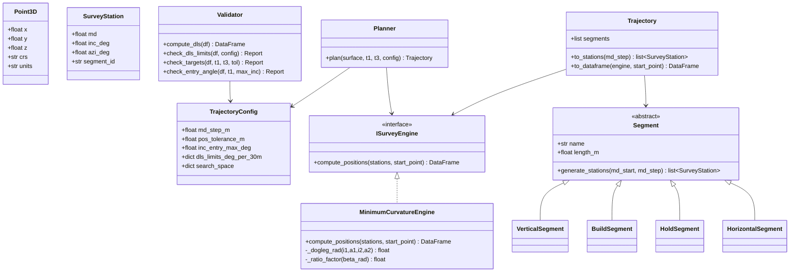

# Построение траектории скважины по трём точкам: устье, вход в пласт (t1), конец горизонтального участка (t3)

## Executive summary

Задача «построить траекторию по трём 3D‑точкам» (устье → t1 → t3) **математически недоопределена**: без дополнительных ограничений (макс. DLS, допустимые углы, тип профиля, шаги по MD, допуски, допущения о неизменности азимута и т.п.) существует бесконечно много траекторий, проходящих через эти точки. Поэтому практический подход в отрасли — фиксировать **семейство профилей** (например, VERTICAL→BUILD→HOLD→BUILD→HORIZONTAL) и подбирать параметры (KOP, BUR/DLS, длины HOLD/HORIZONTAL) под ограничения и попадание в точки. citeturn33view0turn16view0turn34view0turn35view0

Для расчёта координат по (MD, INC, AZI) и контроля искривления отраслевым де‑факто стандартом является **Minimum Curvature Method** (метод минимума кривизны): интервал между соседними станциями аппроксимируется дугой окружности, а координаты считаются по формуле с **ratio factor (RF)**. Этот метод в нефтегазовой индустрии широко принят как стандарт представления траектории, а DLS является производной величиной, вычисляемой по соседним станциям. citeturn33view0turn16view0turn17view1

Ниже дано: строгая математическая база (MCM, DLS и связь с радиусом/скоростью набора), практический алгоритм проектирования по трём точкам (с итерациями и диагностикой неразрешимых случаев), ООП‑архитектура под SOLID/DRY/KISS, примеры модульного Python‑кода (numpy/pandas + опционально scipy), тестовые сценарии и код визуализации (3D, проекции, DLS‑график).

## Требования и параметры

### Входные данные и то, что не задано

| Параметр | Значение | Статус |
|---|---:|---|
| 3D‑координаты устья (S) | **не указано** (ожидаются от пользователя) | требуется |
| 3D‑координаты t1 (вход в пласт) | **не указано** | требуется |
| 3D‑координаты t3 (конец горизонтального участка) | **не указано** | требуется |
| Система координат (N/E/TVD или X/Y/Z; направление оси Z) | **не указано** | критично |
| Единицы (м/ft; градусы) | **не указано** | критично |
| Шаг станций по MD (ΔMD для расчёта таблицы) | **не указано** → рекоменд. 10 м (план), 1–5 м (контроль DLS) | можно задать по умолчанию |
| Допуски попадания в t1/t3 (по XYZ, м) | **не указано** → рекоменд. 0.5–2.0 м (зависит от задачи) | можно задать по умолчанию |
| Максимальный угол входа в пласт | 86° ± **(не указано)** | задан частично |
| Максимальный DLS (°/30 м) по участкам | **не указано** → предложены стартовые значения (конфиг.) | требуется настройка |

### Участки траектории и комбинирование

Требуемые типы участков: **VERTICAL**, **BUILD** (набор / изменение инклинации), **HOLD** (удержание инклинации/азимута), **HORIZONTAL** (инклинация ≈ 90°). Разрешено комбинирование, например VERTICAL→BUILD→HOLD→HORIZONTAL, а также практичный вариант для ограничения «вход в пласт ≤86°»: **VERTICAL→BUILD(to 86°)→HOLD(optional)→BUILD(landing to 90°)→HORIZONTAL**. citeturn16view0turn34view0turn35view0

### Как интерпретировать «вход в пласт» и ограничение 86°

В индустриальной терминологии **inclination (INC)** — это угол между касательной к траектории в точке и вертикалью. citeturn25view0  
Следовательно, «максимальный угол входа в пласт 86°» корректно интерпретировать как:

\[
INC(t1) \le 86^\circ
\]

а «± …» — как допуск по углу, который у вас **не указан**. Практичное значение по умолчанию для допуска в планировщике (если нужен) — ±1° (настраиваемо), но это именно инженерная настройка, а не норма.

## Математическая база

### Система координат, углы и вектор касательной

Для расчётов траектории обычно используют правую декартову систему **North (N), East (E), Vertical (V/TVD)** с началом в устье. В учебной/практической литературе по траекториям также подчёркивается важность явного выбора системы координат и того, что часто берут оси North/East/Vertical как базовые направления. citeturn25view0turn16view0

Азимут (AZI) обычно задаётся как направление проекции касательной на горизонтальную плоскость, отсчитываемое по часовой стрелке от севера. citeturn25view0turn16view0

Единичный вектор касательной \( \mathbf{t} \) (в координатах N/E/V) для станции с инклинацией \(I\) и азимутом \(A\):

\[
\mathbf{t} =
\begin{bmatrix}
\sin I \cos A \\
\sin I \sin A \\
\cos I
\end{bmatrix}
\]

(углы в радианах внутри тригонометрии).

### Minimum Curvature Method (MCM): формулы приращений координат

Метод минимума кривизны рассматривает интервал между двумя соседними станциями как **дугу окружности**. Он общепринят как стандарт представления траектории с середины 1980‑х и является де‑факто отраслевым стандартом вычисления координат по углам. citeturn33view0turn28view0

Для двух станций 1 и 2 с измеренной глубиной \(MD_1, MD_2\), инклинациями \(I_1, I_2\) и азимутами \(A_1, A_2\) (в градусах), в MCM вводится **dogleg‑угол** \(\beta\) и **ratio factor** \(RF\). В учебных материалах по расчёту MCM обычно записывают:

\[
\Delta MD = MD_2 - MD_1
\]

\[
\beta = \cos^{-1}\Big(\cos I_1 \cos I_2 + \sin I_1 \sin I_2 \cos(A_2-A_1)\Big)
\]

\[
RF = \frac{2}{\beta}\tan\Big(\frac{\beta}{2}\Big), \quad \text{где }\beta \text{ должна быть в радианах}
\]

и приращения координат:

\[
\Delta N = \frac{\Delta MD}{2}\left(\sin I_1 \cos A_1 + \sin I_2 \cos A_2\right) RF
\]

\[
\Delta E = \frac{\Delta MD}{2}\left(\sin I_1 \sin A_1 + \sin I_2 \sin A_2\right) RF
\]

\[
\Delta TVD = \frac{\Delta MD}{2}\left(\cos I_1 + \cos I_2\right) RF
\]

Эти формулы (в такой структуре: \(\beta\), \(RF\), затем \(\Delta N, \Delta E, \Delta TVD\)) приведены в типовых учебных конспектах по survey calculations и minimum curvature method. citeturn16view0turn17view1

Важное численное замечание: когда \(\beta \to 0\) (станции почти параллельны), прямое вычисление \(RF\) становится неустойчивым; в стандартах обмена/описаниях алгоритма указывают, что в этом пределе требуется аккуратное вычисление и используют предельные аппроксимации. Практически часто ставят \(RF=1\) при очень малом \(\beta\). citeturn28view0

### DLS (Dogleg Severity): расчёт, смысл и зависимости

**Dogleg severity (DLS)** — нормированная оценка кривизны, обычно выражаемая в **deg/100 ft** или **deg/30 m**. citeturn33view0turn17view1

1) **Dogleg angle** (угол между направлениями ствола) вычисляется по сферической формуле (та же структура, что и в MCM). Популярное математическое объяснение трактует dogleg как угловое расстояние на сфере между двумя направлениями, заданными инклинацией и азимутом. citeturn13view0turn17view1

2) DLS считается **между станциями**, а не «в точке». Технические обзоры подчёркивают, что DLS не является непосредственно измеряемой величиной и что формально он определён на интервалах между станциями. citeturn33view0

3) DLS зависит от длины интервала между станциями; при изменении плотности станций меняется вид графика DLS (он часто «ступенчатый/рваный» именно из‑за кусочно‑дуговой аппроксимации MCM и нормирования на интервал). citeturn33view0

**Формула DLS на интервале**: в учебных материалах часто дают (для deg/100 ft):

\[
DLS_{100ft} = \beta_{deg} \cdot \left(\frac{100}{\Delta MD_{ft}}\right)
\]

где \(\beta_{deg}\) — dogleg‑угол в градусах. citeturn17view1turn16view1

Для метрики deg/30 m:

\[
DLS_{30m} = \beta_{deg} \cdot \left(\frac{30}{\Delta MD_{m}}\right)
\]

### Связь DLS с радиусом кривизны и build rate

Если на участке кривизна постоянна и изменение направления на интервале можно считать дугой окружности (как в MCM), то есть геометрическая связь между:

- угловой скоростью изменения направления \(\frac{d\theta}{ds}\) (рад/м),
- радиусом кривизны \(R\) (м),
- и DLS (deg/30 m).

Из определения дуги окружности: \( s = R \theta \) (в радианах). Это же соотношение интуитивно используют при объяснении dogleg в инженерных терминах (дуга 100 ft, радиус \(\rho\), секторный угол \(\psi\)). citeturn13view0turn33view0

Так как \(\theta = s/R\), то кривизна \( \kappa = 1/R\). Если DLS задан в deg/30 m, то:

\[
DLS_{30m} = \left(\frac{\theta_{deg}}{s_m}\right)\cdot 30
\]

\[
\theta_{rad} = \theta_{deg}\cdot \frac{\pi}{180}
\Rightarrow
\kappa = \frac{\theta_{rad}}{s_m} = \frac{DLS_{30m}\cdot \pi/180}{30}
\Rightarrow
R = \frac{1}{\kappa} = \frac{30\cdot 180}{\pi\cdot DLS_{30m}}
\]

Практический вывод: **чем выше build rate / DLS, тем меньше радиус кривизны** — это прямо отмечают руководства по horizontal wells. citeturn35view0turn30view1turn31view0

### Круговые дуги в плоском профиле: смещения, радиус, центр

Для проектирования типовых профилей (плоская траектория в вертикальной плоскости) удобно использовать формулы дуги окружности. В русскоязычных методических материалах по геонавигации/плоским профилям встречаются стандартные соотношения:

- интенсивность искривления \(i\) как отношение изменения зенитного угла к длине участка по стволу:
  \[
  i = \frac{\theta_k-\theta_n}{l}
  \]
- радиус кривизны \(R \approx \frac{57.3}{i}\) (при \(i\) в град/м, 57.3 ≈ 180/π),
- смещение (отход) дуги на участке набора:
  \[
  A_1 = R(1-\cos \alpha_1)
  \]
- вертикальная составляющая дуги:
  \[
  H_1 = R \sin \alpha_1
  \]
- длина дуги по стволу:
  \[
  l_1 = 0.01745\cdot R\cdot \alpha_1
  \]
(0.01745 ≈ π/180). citeturn41view0

Для 3D‑построения эти формулы удобны как аналитическая «проверка здравого смысла» и как база для 2D‑планировщика (который затем превращает плоское смещение в N/E по азимуту).

## Алгоритм проектирования траектории по точкам S, t1, t3

### Ключевая идея проектирования по 3 точкам

Чтобы получить единственную траекторию из бесконечного множества, выбираем:

- семейство профиля (например, VERTICAL→BUILD→HOLD→BUILD→HORIZONTAL),
- ограничения (INC(t1) ≤ 86°, DLS лимиты по участкам),
- допущения (например, «после KOP азимут постоянен и совпадает с направлением горизонтального участка»).

Далее подбираем параметры профиля итеративно так, чтобы траектория попадала в t1 и t3 с заданным допуском и не нарушала DLS.

Отдельно важно понимать: если вы **не вводите TURN‑участки**, то траектория фактически становится **плоской** (в одной вертикальной плоскости), и тогда горизонтальные проекции точек должны быть почти коллинеарны (в пределах допуска). Если 3D‑точки не укладываются в такую модель — это не ошибка расчёта, а признак того, что в профиле нужны повороты (изменение азимута) либо дополнительные контрольные точки.

### Пошаговый метод (плоский планировщик с выходом в 3D)

Ниже — практичный вариант, который хорошо «ложится» на ваши сегменты и ограничение входа 86°.

**Шаг подготовки**

Определите:
- \(S = (x_s,y_s,z_s)\), \(t1=(x_1,y_1,z_1)\), \(t3=(x_3,y_3,z_3)\) в одной и той же системе координат и единицах.
- Что такое «z»: TVD вниз (рекомендовано) или вверх (тогда меняются знаки).
- Конвенция: azimuth считается от North по часовой стрелке, что стандартно в определениях. citeturn25view0turn16view0

**Шаг геометрии горизонтального участка**

1) Горизонтальное направление (азимут латерали) берём из вектора \(\vec{h} = (x_3-x_1,\;y_3-y_1)\).  
\[
A_{lat} = \operatorname{atan2}(E,\;N) = \operatorname{atan2}(x_3-x_1,\;y_3-y_1)
\]
(в градусах нормируем в [0,360)).

2) Проверка «плоскостности» (без TURN): вычислите поперечное отклонение t1 и t3 относительно направления \(A_{lat}\). Если поперечная компонента больше допуска — профиль без поворота не сможет попасть в обе точки.

**Шаг выбора параметров‑переменных**

Параметры для подбора (минимальный набор):
- \(I_{entry} = INC(t1)\) (должно быть ≤ 86°; это ваш «угол входа в пласт» — угол между касательной и вертикалью). citeturn25view0
- \(DLS_{build1}\) (или BUR) на участке BUILD до \(I_{entry}\).
- \(DLS_{build2}\) (landing) на участке BUILD от \(I_{entry}\) до 90°.
- Длины HOLD‑участков (до t1 и/или внутри пласта до начала landing).

Связь DLS↔R позволяет переходить между «ограничением по DLS» и «радиусом дуги». citeturn13view0turn41view0turn33view0

**Шаг аналитических уравнений в плоской вертикальной плоскости**

Пусть после KOP азимут постоянен и равен \(A_{lat}\). Тогда горизонтальные смещения считаем в продольной оси \(s\) (вдоль азимута). Для BUILD‑дуги от \(I_0\) до \(I_1\) с радиусом \(R\):

- длина по стволу:
  \[
  L_{arc}=R(\Delta I)_{rad}
  \]
- вертикальная прибавка:
  \[
  \Delta TVD = R(\sin I_1-\sin I_0)
  \]
- продольная горизонтальная прибавка:
  \[
  \Delta s = R(\cos I_0-\cos I_1)
  \]

Эти соотношения эквивалентны стандартным формулам плоского профиля (отход \(R(1-\cos \alpha)\), вертикаль \(R\sin\alpha\), длина дуги \(R\alpha\) при старте с 0°). citeturn41view0

Далее:
- HOLD при постоянном \(I\):  
  \(\Delta TVD = L\cos I,\; \Delta s = L\sin I\).
- HORIZONTAL при \(I=90^\circ\):  
  \(\Delta TVD \approx 0,\; \Delta s = L\).

**Шаг решения на попадание в t1 и t3**

Типовой профиль для вашего кейса (с ограничением на угол входа) удобно делать так:

VERTICAL → BUILD1(to \(I_{entry}\)) → HOLD1(to reach t1) → HOLD2(optional in reservoir) → BUILD2(to 90°) → HORIZONTAL(to t3)

Вариант, который часто получается устойчивым:
- положить **точку t1 на конце HOLD1** (то есть в t1 ориентация уже \(I_{entry}, A_{lat}\));
- затем подобрать HOLD2 + BUILD2 + HORIZONTAL так, чтобы попасть в t3 по TVD и по продольному смещению.

Условия разрешимости в такой постановке:
- все вычисленные длины участков должны быть ≥ 0,
- \(I_{entry}\le 86^\circ\),
- требуемые DLS на BUILD‑участках не превышают лимиты,
- поперечные отклонения (если без TURN) малы.

**Итеративный подбор (grid search / least_squares)**

Поскольку входные данные неполные и в реальных данных возможны несовместимости, практично делать итеративный поиск:

- внешний цикл по \(I_{entry}\) в диапазоне [60°, 86°] (или шире),
- внутренний цикл по \(DLS_{build1}\), \(DLS_{build2}\) в допустимых диапазонах,
- на каждом наборе параметров считаем длины участков по аналитическим формулам, затем генерируем survey‑станции и пересчитываем координаты MCM, оцениваем ошибки попадания и DLS.

Критерии сходимости:
- \(\|\mathbf{p}(t1)-t1\|\le \varepsilon_{pos}\)
- \(\|\mathbf{p}(t3)-t3\|\le \varepsilon_{pos}\)
- \(\max(DLS_{interval})\le DLS_{max}(segment)\)

Если минимум целевой функции (ошибки попадания + штрафы за нарушения) недостижим — кейс помечаем как «неразрешимый при выбранной структуре профиля» (например, нужен TURN или нужно ослабить ограничения).

### Mermaid‑flowchart алгоритма

```mermaid
flowchart TD
  A[Ввод S, t1, t3 + единицы/система координат] --> B[Нормализация / проверка данных]
  B --> C[Определить направление HORIZONTAL: A_lat из (t1->t3)]
  C --> D{Можно считать профиль плоским?\n(поперечная ошибка мала)}
  D -- нет --> D2[Нужен TURN или доп. точки\n(в текущем этапе: ошибка/флаг)] 
  D -- да --> E[Итеративный подбор: I_entry, DLS_build1, DLS_build2, длины HOLD]
  E --> F[Синтез сегментов VERTICAL/BUILD/HOLD/HORIZONTAL]
  F --> G[Генерация survey stations (MD, INC, AZI)]
  G --> H[Пересчёт XYZ по Minimum Curvature]
  H --> I[Валидация: попадание в t1/t3 + DLS + INC(t1)≤86]
  I --> J{Условия выполнены?}
  J -- да --> K[Сохранить лучшее решение + отчёт]
  J -- нет --> E
```

## ООП‑дизайн под SOLID, DRY, KISS

### Принципы

- **SRP (Single Responsibility)**: расчёт координат (MCM) не смешивать с планированием (подбором параметров), а валидацию DLS/ограничений — с генерацией станций.
- **OCP**: новые сегменты (например, TURN, DROP, SCurve) добавляются как новые классы, не меняя ядро расчёта координат.
- **DIP**: планировщик зависит от абстракции `ISurveyEngine`, чтобы можно было заменить MCM на другой метод (например, spline‑интерполяцию, которую обсуждают как альтернативу MCM в спец‑применениях). citeturn33view0
- **DRY/KISS**: один источник истины для формул \(\beta\), RF, DLS.

### Предложение классов и интерфейсов

- `Point3D`: x, y, z (+ метаданные: datum, units).
- `TrajectoryConfig`:
  - `md_step_m` (по умолчанию 10),
  - `pos_tolerance_m` (по умолчанию 1),
  - `inc_entry_max_deg=86`,
  - `dls_limits` (словарь по типам сегментов, deg/30m),
  - `search_space` (диапазоны поиска).
- `SurveyStation`: MD, INC, AZI (+ служебно: segment_id).
- `ISurveyEngine` (протокол/ABC): `compute_positions(stations, start_point) -> DataFrame`.
- `MinimumCurvatureEngine(ISurveyEngine)`: реализует MCM по формулам \(\beta\), RF, \(\Delta N,\Delta E,\Delta TVD\). citeturn16view0turn28view0
- `Segment(ABC)`:
  - `length_m`,
  - `start_inc_deg`, `end_inc_deg`, `start_azi_deg`, `end_azi_deg`,
  - `generate_stations(md_start, md_step) -> list[SurveyStation]`.
- Реализации `Segment`:
  - `VerticalSegment` (INC=0),
  - `BuildSegment` (INC линейно по MD; AZI константа или линейно),
  - `HoldSegment` (INC, AZI константы),
  - `HorizontalSegment` (INC=90, AZI константа).
- `Trajectory`:
  - `segments: list[Segment]`,
  - `to_stations()` и `to_dataframe(engine)`.
- `Validator`:
  - `check_entry_angle(df, t1, ...)`,
  - `compute_dls(df)` и `check_dls_limits(df, config)`,
  - `check_targets(df, t1, t3)`.
- `Planner`:
  - `plan(surface, t1, t3, config) -> TrajectorySolution`,
  - стратегия поиска (grid / scipy.optimize).

### Mermaid‑диаграмма архитектуры



## Примеры кода на Python

Ниже фрагменты ориентированы на: numpy + pandas, модульность, тестируемость, типизацию. Формулы MCM и DLS соответствуют стандартным выражениям с dogleg‑углом \(\beta\) и ratio factor \(RF\). citeturn16view0turn17view1turn13view0

### Минимальная кривизна и DLS

```python
from __future__ import annotations
from dataclasses import dataclass
import numpy as np
import pandas as pd

DEG2RAD = np.pi / 180.0
RAD2DEG = 180.0 / np.pi

def _wrap_azimuth_deg(azi: np.ndarray) -> np.ndarray:
    """Normalize azimuth to [0, 360)."""
    return np.mod(azi, 360.0)

def dogleg_angle_rad(inc1_deg, azi1_deg, inc2_deg, azi2_deg) -> np.ndarray:
    """Dogleg angle β in radians."""
    i1 = np.asarray(inc1_deg) * DEG2RAD
    i2 = np.asarray(inc2_deg) * DEG2RAD
    a1 = np.asarray(azi1_deg) * DEG2RAD
    a2 = np.asarray(azi2_deg) * DEG2RAD

    # cosβ = cosI1 cosI2 + sinI1 sinI2 cos(ΔA)
    cosb = np.cos(i1) * np.cos(i2) + np.sin(i1) * np.sin(i2) * np.cos(a2 - a1)
    cosb = np.clip(cosb, -1.0, 1.0)
    return np.arccos(cosb)

def ratio_factor(beta_rad: np.ndarray, eps: float = 1e-12) -> np.ndarray:
    """
    Ratio Factor RF = (2/β) * tan(β/2) with safe handling near β≈0.
    """
    beta = np.asarray(beta_rad)
    rf = np.ones_like(beta)
    mask = beta > eps
    rf[mask] = (2.0 / beta[mask]) * np.tan(beta[mask] / 2.0)
    return rf

def dls_deg_per_30m(md1_m, inc1_deg, azi1_deg, md2_m, inc2_deg, azi2_deg) -> np.ndarray:
    """DLS in deg/30m between stations."""
    md1 = np.asarray(md1_m, dtype=float)
    md2 = np.asarray(md2_m, dtype=float)
    dmd = md2 - md1
    beta_deg = dogleg_angle_rad(inc1_deg, azi1_deg, inc2_deg, azi2_deg) * RAD2DEG
    return beta_deg * (30.0 / dmd)

def minimum_curvature_increment(md1_m, inc1_deg, azi1_deg, md2_m, inc2_deg, azi2_deg):
    """
    Compute ΔN, ΔE, ΔTVD for one interval using Minimum Curvature Method.
    """
    dmd = float(md2_m - md1_m)
    i1 = inc1_deg * DEG2RAD
    i2 = inc2_deg * DEG2RAD
    a1 = azi1_deg * DEG2RAD
    a2 = azi2_deg * DEG2RAD

    beta = float(dogleg_angle_rad(inc1_deg, azi1_deg, inc2_deg, azi2_deg))
    rf = float(ratio_factor(np.array([beta]))[0])

    dN = (dmd / 2.0) * (np.sin(i1) * np.cos(a1) + np.sin(i2) * np.cos(a2)) * rf
    dE = (dmd / 2.0) * (np.sin(i1) * np.sin(a1) + np.sin(i2) * np.sin(a2)) * rf
    dTVD = (dmd / 2.0) * (np.cos(i1) + np.cos(i2)) * rf
    return dN, dE, dTVD
```

### Генерация таблицы survey stations и расчёт XYZ

```python
@dataclass(frozen=True)
class Point3D:
    x: float  # Easting (или X)
    y: float  # Northing (или Y)
    z: float  # TVD (вниз) или Depth

def compute_positions_min_curv(stations: pd.DataFrame, start: Point3D) -> pd.DataFrame:
    """
    stations columns: MD_m, INC_deg, AZI_deg
    returns: same + N,E,TVD and optionally X,Y,Z mapping.
    """
    df = stations.copy()
    df["AZI_deg"] = _wrap_azimuth_deg(df["AZI_deg"].to_numpy())

    N = [start.y]
    E = [start.x]
    TVD = [start.z]

    for k in range(1, len(df)):
        md1, md2 = df.loc[k-1, "MD_m"], df.loc[k, "MD_m"]
        i1, i2 = df.loc[k-1, "INC_deg"], df.loc[k, "INC_deg"]
        a1, a2 = df.loc[k-1, "AZI_deg"], df.loc[k, "AZI_deg"]
        dN, dE, dTVD = minimum_curvature_increment(md1, i1, a1, md2, i2, a2)
        N.append(N[-1] + dN)
        E.append(E[-1] + dE)
        TVD.append(TVD[-1] + dTVD)

    df["N_m"] = N
    df["E_m"] = E
    df["TVD_m"] = TVD
    # если хотите X,Y,Z:
    df["X_m"] = df["E_m"]
    df["Y_m"] = df["N_m"]
    df["Z_m"] = df["TVD_m"]
    return df

def add_dls(df: pd.DataFrame) -> pd.DataFrame:
    out = df.copy()
    dls = np.full(len(out), np.nan)
    dls[1:] = dls_deg_per_30m(
        out["MD_m"].values[:-1], out["INC_deg"].values[:-1], out["AZI_deg"].values[:-1],
        out["MD_m"].values[1:],  out["INC_deg"].values[1:],  out["AZI_deg"].values[1:]
    )
    out["DLS_deg_per_30m"] = dls
    return out
```

### Сегменты (VERTICAL/BUILD/HOLD/HORIZONTAL) и сборка траектории

```python
from abc import ABC, abstractmethod

class Segment(ABC):
    name: str

    @abstractmethod
    def generate(self, md_start: float, md_step: float) -> pd.DataFrame:
        """Return stations for this segment with columns MD_m, INC_deg, AZI_deg, segment."""
        raise NotImplementedError

class VerticalSegment(Segment):
    name = "VERTICAL"
    def __init__(self, length_m: float, azi_deg: float = 0.0):
        self.length_m = float(length_m)
        self.azi_deg = float(azi_deg)

    def generate(self, md_start: float, md_step: float) -> pd.DataFrame:
        md_end = md_start + self.length_m
        md = np.append(np.arange(md_start, md_end, md_step), md_end)
        inc = np.zeros_like(md)
        azi = np.full_like(md, self.azi_deg, dtype=float)
        return pd.DataFrame({"MD_m": md, "INC_deg": inc, "AZI_deg": azi, "segment": self.name})

class HoldSegment(Segment):
    name = "HOLD"
    def __init__(self, length_m: float, inc_deg: float, azi_deg: float):
        self.length_m = float(length_m)
        self.inc_deg = float(inc_deg)
        self.azi_deg = float(azi_deg)

    def generate(self, md_start: float, md_step: float) -> pd.DataFrame:
        md_end = md_start + self.length_m
        md = np.append(np.arange(md_start, md_end, md_step), md_end)
        inc = np.full_like(md, self.inc_deg, dtype=float)
        azi = np.full_like(md, self.azi_deg, dtype=float)
        return pd.DataFrame({"MD_m": md, "INC_deg": inc, "AZI_deg": azi, "segment": self.name})

class BuildSegment(Segment):
    name = "BUILD"
    def __init__(self, inc_from_deg: float, inc_to_deg: float, dls_deg_per_30m: float, azi_deg: float):
        self.inc_from = float(inc_from_deg)
        self.inc_to = float(inc_to_deg)
        self.dls = float(dls_deg_per_30m)
        self.azi_deg = float(azi_deg)

        delta_inc = abs(self.inc_to - self.inc_from)
        # длина по стволу из определения BUR/DLS: delta_inc (deg) / dls (deg/30m) * 30m
        self.length_m = (delta_inc / self.dls) * 30.0 if self.dls > 0 else 0.0

    def generate(self, md_start: float, md_step: float) -> pd.DataFrame:
        md_end = md_start + self.length_m
        md = np.append(np.arange(md_start, md_end, md_step), md_end)
        t = (md - md_start) / max(self.length_m, 1e-9)
        inc = self.inc_from + (self.inc_to - self.inc_from) * t
        azi = np.full_like(md, self.azi_deg, dtype=float)
        return pd.DataFrame({"MD_m": md, "INC_deg": inc, "AZI_deg": azi, "segment": self.name})

class HorizontalSegment(Segment):
    name = "HORIZONTAL"
    def __init__(self, length_m: float, azi_deg: float):
        self.length_m = float(length_m)
        self.azi_deg = float(azi_deg)

    def generate(self, md_start: float, md_step: float) -> pd.DataFrame:
        md_end = md_start + self.length_m
        md = np.append(np.arange(md_start, md_end, md_step), md_end)
        inc = np.full_like(md, 90.0, dtype=float)
        azi = np.full_like(md, self.azi_deg, dtype=float)
        return pd.DataFrame({"MD_m": md, "INC_deg": inc, "AZI_deg": azi, "segment": self.name})

class WellTrajectory:
    def __init__(self, segments: list[Segment]):
        self.segments = segments

    def stations(self, md_step: float) -> pd.DataFrame:
        parts = []
        md_start = 0.0
        for seg in self.segments:
            block = seg.generate(md_start, md_step)
            if parts:
                # убрать первый ряд, чтобы не дублировать границу сегментов
                block = block.iloc[1:].copy()
            parts.append(block)
            md_start = float(block["MD_m"].iloc[-1])
        return pd.concat(parts, ignore_index=True)
```

### Опционально: scipy для итеративного подбора

Если доступен SciPy, удобно решать задачу подбора параметров как constrained least‑squares (например, `scipy.optimize.least_squares`) с штрафами за:
- INC(t1) > 86°,
- DLS превышение,
- отрицательные длины сегментов,
- поперечный промах по плану.

SciPy здесь не обязателен, но повышает устойчивость результата на «грязных» входных данных.

### Библиотеки, которые целесообразно использовать

- `numpy`, `pandas` — базовый расчёт и таблицы.
- `scipy` — оптимизация/least‑squares для подбора параметров.
- `matplotlib` (или `plotly`) — 2D/3D визуализация.
- `pyproj` — если координаты в геодезических системах и нужен перевод в локальную (E/N) (в RESQML отмечают, что расчёты ведут в локальной проекции и игнорируют кривизну Земли, что может быть важно для ERD; это нужно осознавать). citeturn28view0
- Готовые библиотеки для справки (не обязательно использовать, но полезно сверять): `well_profile`, `wellpathpy`, `welleng` (в их документации подчёркивается, что standard‑подход — minimum curvature, и есть расчёт DLS/ресемплинг). citeturn36view0turn38search2turn38search10turn38search11
- Примеры реализаций MCM на Python (GitHub‑репозитории) — полезны для сверки формул и графиков. citeturn38search0turn38search23

## Тесты и визуализации

### Тестовые сценарии

Ниже — три **синтетических** сценария (координаты в метрах, система: X=E, Y=N, Z=TVD вниз). Они предназначены для проверки логики попадания, DLS‑контроля и ограничения INC(t1)≈86.

| Сценарий | S (устье) | t1 (вход) | t3 (конец горизонт.) | Ожидаемые проверки |
|---|---|---|---|---|
| Вертикаль → soft‑landing → горизонт | (0,0,0) | (300,0,2500) | (1500,0,2600) | INC(t1) ≤ 86; попадание в точки ≤ tol; DLS на BUILD в лимите; HORIZONTAL ~90° |
| J‑профиль с HOLD | (0,0,0) | (600,0,2400) | (2600,0,2600) | ненулевая длина HOLD до t1; landing до 90°; DLS соблюдён |
| Граничный вход ≈86° | (0,0,0) | (800,0,2500) | (2800,0,2650) | INC(t1)≈86 (±tol); проверка, что решение не уходит выше 86; DLS близко к лимиту, но не превышает |

Проверки должны включать:
- `distance(t1_calc, t1) <= pos_tolerance_m`
- `distance(t3_calc, t3) <= pos_tolerance_m`
- `max(DLS_deg_per_30m on BUILD segments) <= dls_build_limit`
- `INC at nearest station to t1 <= 86 (+/- tol_angle если введёте)`.

### Пример кода визуализации

```python
import matplotlib.pyplot as plt

def plot_trajectory(df: pd.DataFrame):
    # 3D
    fig = plt.figure()
    ax = fig.add_subplot(111, projection="3d")
    ax.plot(df["X_m"], df["Y_m"], df["Z_m"])
    ax.set_xlabel("X (E), m")
    ax.set_ylabel("Y (N), m")
    ax.set_zlabel("Z (TVD), m")
    ax.invert_zaxis()  # обычно глубина вниз
    plt.title("Well trajectory (3D)")

    # Plan view (E vs N)
    plt.figure()
    plt.plot(df["E_m"], df["N_m"])
    plt.xlabel("E, m")
    plt.ylabel("N, m")
    plt.title("Plan view (E-N)")
    plt.axis("equal")

    # Vertical section (VS vs TVD) — упрощённо: если профиль плоский, VS≈E вдоль азимута
    plt.figure()
    plt.plot(df["MD_m"], df["TVD_m"])
    plt.xlabel("MD, m")
    plt.ylabel("TVD, m")
    plt.title("TVD vs MD")
    plt.gca().invert_yaxis()

def plot_dls(df: pd.DataFrame):
    plt.figure()
    plt.plot(df["MD_m"], df["DLS_deg_per_30m"])
    plt.xlabel("MD, m")
    plt.ylabel("DLS, deg/30m")
    plt.title("DLS vs MD")
```

### Таблицы результатов и сравнения

Ожидаемый артефакт расчёта — DataFrame станций:

`MD, INC, AZI, X, Y, Z, segment, DLS_deg_per_30m`

и отдельная сводка:

- max DLS по каждому сегменту,
- INC(t1),
- промахи по t1/t3.

Это удобно оформлять как две таблицы: (1) полный survey и (2) summary‑таблица.

## Рекомендации по параметрам DLS и ограничениям

### Почему DLS должен быть конфигурируемым

DLS — величина, зависящая от интервала станций и способа интерполяции; он «не живёт в точке», а определяется между станциями, и при разных ΔMD вид «профиля DLS» меняется. Поэтому лимит DLS всегда должен быть **параметром**, а не «зашитой константой». citeturn33view0

### Ориентировочные DLS‑лимиты по участкам (стартовые значения)

Ниже — **разумные дефолты для планировщика** (их следует согласовать с вашим стандартом по оборудованию/эксплуатации; в отрасли диапазоны сильно различаются). Основание для диапазонов — опубликованные классификации по build rate (deg/100ft) от Baker Hughes/учебных материалов и практики short radius (SPE‑paper summary у Weatherford). citeturn30view1turn31view0turn39view0turn40view0

Перевод единиц: \(deg/30m \approx 0.984 \cdot deg/100ft\) (30 м против 30.48 м), для инженерных оценок часто можно считать «почти одинаково».

| Участок | Рекомендуемый max DLS (deg/30m) | Комментарий |
|---|---:|---|
| VERTICAL | 0.5–1.0 | Планово стремиться к ~0; лимит вводится как «допуск на дрейф/шум». (Эвристика планировщика; DLS вообще определяется между станциями.) citeturn33view0 |
| BUILD (основной набор до t1) | 2–8 | Соответствует long‑radius семейству (2–8°/100ft) в распространённой классификации. citeturn30view1 |
| HOLD | ≤1–2 | На HOLD идеал — 0; лимит нужен, если вы допускаете «подруливание» или если станция пересекает границу сегментов. citeturn33view0 |
| BUILD (landing внутри пласта до 90°) | 2–10 (или выше, при спец. инструменте) | Если нужен более резкий landing, можно уходить к medium‑radius диапазонам (8–25°/100ft), но это уже другие риски/ограничения. citeturn30view1turn35view0 |
| HORIZONTAL | ≤2 | В горизонтальном стволе часто стремятся минимизировать «нежелательную кривизну»; DLS используют как показатель для планирования и качества. citeturn33view0turn37view0 |

Дополнение: в практических обзорах по conventional drilling нередко указан «типичный build‑up rate 1–3°/100ft» для стандартных условий, а более высокие значения рассматриваются как более «dogleg‑подобные» режимы — это можно использовать как стартовую консервативную настройку для BUILD1, если вы не целитесь в короткий радиус. citeturn39view0turn40view0  
Для short radius отдельные публикации (SPE‑материалы) упоминают build rates порядка 35–70°/100ft, что на порядок выше long‑radius диапазонов. citeturn31view0

### Ограничение INC(t1) ≤ 86° и практический смысл

Так как inclination — угол между касательной и вертикалью citeturn25view0, ограничение 86° означает «на входе в пласт мы ещё не полностью горизонтальны». Это типично приводит к необходимости **landing‑участка после входа**, то есть второй BUILD до 90° на глубине уже внутри пласта (или близко к нему), чтобы затем удерживать горизонтальный участок до t3.

### Источники и приоритетность

- Minimum Curvature как стандарт и нюансы DLS (зависимость от интервала, «DLS не в точке») — технический обзор по dogleg severity и MCM. citeturn33view0  
- Формулы MCM (β, RF, ΔN/ΔE/ΔTVD) и базовая формула DLS — учебные материалы по survey calculations. citeturn16view0turn17view1  
- Описание minimum‑curvature interpolation как circular‑arc метода в отраслевом стандарте данных (RESQML/Energistics). citeturn28view0  
- Классификация build rates по радиусам (Baker Hughes build rate definitions) — учебный workshop‑материал (OGS). citeturn30view1  
- Short radius build rates (35–70°/100ft) — summary SPE‑paper у Weatherford. citeturn31view0  
- Русскоязычные формулы плоских профилей: интенсивность искривления, связь с радиусом, отход/вертикаль на дуге. citeturn41view0  
- Контекст API RP 78: цель — рамка и минимум руководства по жизненному циклу wellbore position data, включая представление траектории, расчёт и QA/QC. citeturn10view0