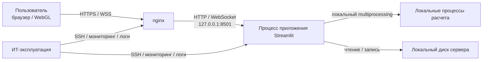

# Целевая техническая архитектура проекта «Конструктор прототипов траекторий»

Статус: версия для согласования с ИТ-службой  
Официальное наименование проекта: «Конструктор прототипов траекторий»  
Технический код проекта: `pywp`

---

## Таблица 7. Используемые сокращения

| Сокращение | Расшифровка |
| --- | --- |
| ACL | Access Control List, список контроля доступа |
| CPU | Центральный процессор |
| DEV | Среда разработки |
| DNS | Служба доменных имен |
| HA | High Availability, высокая доступность |
| HTTPS | Защищенный HTTP |
| IAM | Система управления учетными записями и доступом |
| IT | Информационные технологии |
| NTP | Сервис синхронизации времени |
| PROD | Продуктивная среда |
| RPO | Recovery Point Objective, допустимая точка потери данных |
| RTO | Recovery Time Objective, допустимое время восстановления |
| SSO | Single Sign-On, единый вход |
| TEST / UAT | Тестовая / приемочная среда |
| TLS | Протокол криптографической защиты транспортного канала |
| VM | Виртуальная машина |
| WebSocket | Двусторонний сетевой протокол для интерактивной веб-сессии |
| ЦОД | Центр обработки данных |

## 2 ВВОДНАЯ ЧАСТЬ

### 2.1 ЦЕЛЬ ДОКУМЕНТА

Этот документ фиксирует техническую архитектуру проекта «Конструктор прототипов траекторий» для корпоративного внедрения.

Документ нужен для того, чтобы ИТ-служба, эксплуатация и заказчик одинаково понимали:

- как именно разворачивается система;
- из каких компонентов она состоит;
- какие серверные ресурсы ей нужны;
- как она подключается к сети;
- как она резервируется, мониторится и обслуживается;
- какие ограничения есть у первой production-версии.

В документе закреплен самый простой и надежный вариант реализации:

- одна Linux VM на среду;
- один `nginx` на этой VM;
- один экземпляр приложения `Streamlit`;
- локальный запуск расчетных процессов на этом же сервере;
- восстановление за счет устойчивой VM, автоматического рестарта сервиса и резервного копирования.

Документ не заменяет собой:

- инструкцию администратора;
- пошаговую инструкцию по развертыванию;
- программу и методику испытаний;
- комплект формальных документов по ИБ.

### 2.2 НАЗНАЧЕНИЕ ПРОЕКТИРУЕМОЙ СИСТЕМЫ

Проект «Конструктор прототипов траекторий» предназначен для инженерной работы с траекториями скважин.

Система выполняет следующие задачи:

- импортирует исходные данные и траектории из инженерных файлов, включая WELLTRACK и `.dev`;
- строит проектные траектории;
- выполняет пакетные расчеты;
- проводит anti-collision анализ;
- показывает результаты в 2D и 3D;
- формирует экспортные файлы для дальнейшей работы.

Технически система реализована как внутреннее веб-приложение на Python с интерфейсом на `Streamlit`.

Текущая реализация работает так:

- пользовательская сессия и текущее рабочее состояние хранятся в памяти процесса приложения;
- тяжелые расчеты запускаются с этого же сервера в отдельных процессах;
- приложение само выбирает режим выполнения: последовательно, в 2 процесса или в 4 процесса;
- часть сценариев при проблеме с пулом процессов продолжает работу в последовательном режиме.

Система имеет три понятных уровня:

1. рабочее место пользователя и браузер;
2. `nginx`, который принимает HTTPS-трафик;
3. приложение `Streamlit` и локальные расчетные процессы.

Во внутренней архитектуре нет внешней базы данных и нет отдельного кластера вычислений. Это важная особенность системы. Именно она определяет целевую схему внедрения: один сервер, один экземпляр приложения, локальный multiprocessing и понятное восстановление после сбоя.

## 3 ТЕХНИЧЕСКИЕ ТРЕБОВАНИЯ К СИСТЕМЕ

### 3.1 ТРЕБОВАНИЯ К ПРОИЗВОДИТЕЛЬНОСТИ И СТАБИЛЬНОСТИ СИСТЕМЫ

Система проектируется на контур из 15 пользователей.

Для production-среды фиксируются следующие рабочие пределы:

- 15 активных пользовательских веб-сессий;
- 2 одновременных тяжелых расчетных операции;
- параллельная работа пользователей с интерфейсом во время расчетов;
- один экземпляр приложения на сервере.

Три и более одновременных тяжелых расчета считаются выходом за штатный режим первой production-версии.

Целевые показатели работы системы приведены в таблице.

| Параметр | Значение | Пояснение |
| --- | --- | --- |
| Количество пользователей | 15 | Целевой контур PROD |
| Тип доступа | веб-доступ через браузер | Без толстого клиента |
| Отзывчивость легких операций | до 3 секунд | Переходы по интерфейсу, просмотр, фильтрация |
| Одновременные тяжелые расчеты | 2 | пакетный расчет и anti-collision |
| Доступность PROD | 99,5% в год | SLA согласован |
| RTO PROD | до 4 часов | Восстановление после отказа VM или сервиса |
| RPO по конфигурации и экспортам | до 24 часов | При ежедневном резервном копировании |
| Потеря активной сессии при рестарте | допустима | Ограничение текущей архитектуры |

С точки зрения нагрузки операции системы делятся на три класса.

| Класс операции | Примеры | Нагрузка | Ожидаемое поведение |
| --- | --- | --- | --- |
| Легкие | открытие экрана, переключение вкладок, просмотр результатов | короткая нагрузка на CPU и память | интерфейс остается отзывчивым |
| Средние | импорт файла, подготовка данных, экспорт | смешанная нагрузка на CPU, память и диск | возможны короткие пиковые задержки |
| Тяжелые | пакетный расчет, anti-collision на крупном наборе данных | выраженная нагрузка на CPU и рост числа процессов | расчет выполняется без падения сервиса |

Под стабильностью в этом документе понимается не только доступность URL, но и нормальная работа всей цепочки:

- пользователь может открыть систему;
- сессия устанавливается через `nginx`;
- приложение принимает команды;
- расчеты выполняются без потери управляемости сервиса;
- после сбоя система возвращается в рабочее состояние в пределах согласованного RTO.

Ключевой технический вывод по разделу: для текущей реализации самый надежный вариант работы на production-нагрузке — один экземпляр приложения на Linux-сервере с локальным multiprocessing.

## 4 ОПИСАНИЕ СТРУКТУРЫ И ТЕХНИЧЕСКАЯ РЕАЛИЗАЦИЯ

### 4.1 ГРАФИЧЕСКАЯ СХЕМА С ВЗАИМОСВЯЗЯМИ КОМПОНЕНТОВ СИСТЕМЫ

#### 1-й уровень. Узлы, каналы, пользователи

#### 2-й уровень. Среды

| Среда | Назначение | Размещение | Особенность |
| --- | --- | --- | --- |
| DEV | разработка и внутренняя инженерная проверка | отдельная VM | без пользовательской эксплуатации |
| TEST / UAT | интеграционные, регрессионные и приемочные проверки | отдельная VM | повторяет production-схему |
| PROD | рабочая эксплуатация | отдельная VM | доступ только из корпоративной сети |

#### 3-й уровень. Взаимодействие сред

Среды `DEV`, `TEST / UAT` и `PROD` изолированы друг от друга. Общего рабочего трафика между ними нет. Между средами перемещаются только артефакты релиза и согласованные конфигурации в рамках релизного процесса.

Практический смысл схемы простой:

- пользователь всегда входит в систему через единый HTTPS-адрес;
- внешний доступ идет только к `nginx`;
- `Streamlit` не публикуется в сеть напрямую;
- расчетные процессы не являются сетевыми сервисами;
- экспортные и временные файлы хранятся локально на сервере.

### 4.2 ОПИСАНИЕ ТРЕБОВАНИЙ К РЕАЛИЗАЦИИ СЕРВЕРНОЙ ЧАСТИ

#### 4.2.1 Базовый архитектурный вариант

Серверная часть реализуется по следующей схеме:

- одна Linux VM на каждую среду;
- один `nginx` на этой VM;
- один экземпляр `Streamlit` на этой VM;
- один локальный расчетный контур на этой же VM;
- один локальный каталог для логов, временных файлов и экспортов;
- автоматический рестарт сервиса через `systemd`;
- резервирование на уровне виртуализации и резервного копирования.

Это не кластер и не active-active схема. Это устойчивое развертывание с одним экземпляром приложения.

#### 4.2.2 Обоснование выбора

Этот вариант выбран потому, что он лучше всего совпадает с текущим устройством приложения.

1. Пользовательское состояние хранится в памяти процесса `Streamlit`.  
   Значит приложение не является бессессионным веб-сервисом.

2. Тяжелые расчеты запускаются локально через multiprocessing.  
   Значит вычисления уже привязаны к конкретному процессу приложения и к конкретному серверу.

3. На Linux процессный пул работает штатно и предсказуемо.  
   Это делает Linux основной серверной платформой проекта.

4. Схема с несколькими экземплярами `Streamlit` за `nginx` для текущей версии не упрощает систему, а усложняет ее:
   - появляется жесткая привязка пользовательской сессии к конкретному экземпляру приложения;
   - растет риск рассинхронизации пользовательского состояния;
   - несколько экземпляров начинают конкурировать за CPU;
   - управлять расчетными процессами становится сложнее.

Итог: один сервер и один экземпляр приложения дают для этой версии системы больше надежности, чем горизонтальное масштабирование интерфейса.

#### 4.2.3 Размещение компонентов

| Компонент | Размещение | Назначение |
| --- | --- | --- |
| VM среды | корпоративный ЦОД | основной узел среды |
| Linux | внутри VM | базовая серверная платформа |
| `nginx` | на том же узле | HTTPS, WebSocket, контроль доступа |
| `Streamlit` | на том же узле | интерфейс и управление расчетами |
| Процессы расчета | на том же узле | ресурсоемкие расчеты |
| Локальный диск | на том же узле | логи, временные файлы, экспорты |

#### 4.2.4 Требования к дата-центру и хостовой платформе

| Требование | Значение |
| --- | --- |
| Тип размещения | корпоративный ЦОД |
| Тип платформы | отказоустойчивая виртуализация |
| Питание, сеть, хранение | по стандарту ЦОД |
| Резервное копирование VM | обязательно |
| Быстрый рестарт VM | обязательно |
| Системное время | синхронизация по NTP |
| DNS | корпоративный DNS |

#### 4.2.5 Требования к сетевому уровню

| Параметр | Значение |
| --- | --- |
| Пользовательский доступ | только из корпоративной сети |
| Публикация сервиса | только через `nginx` |
| Пользовательский протокол | `HTTPS / WSS` |
| Прямой доступ к порту Streamlit | запрещен |
| Скорость uplink сервера | 1 Gbps |
| Доступ к DNS и NTP | обязателен |

#### 4.2.6 Требования к системе коммутации

| Параметр | Значение |
| --- | --- |
| Класс оборудования | управляемая корпоративная L2/L3 сеть |
| Скорость серверных портов | не ниже 1 Gbps |
| Мониторинг сетевого уровня | обязателен |
| Резервирование сети | по стандарту площадки |

#### 4.2.7 Структура каждой среды

| Среда | Схема | CPU | RAM | Disk |
| --- | --- | --- | --- | --- |
| DEV | `nginx + Streamlit + локальные процессы расчета` | 4 vCPU | 16 GB | 50 GB SSD |
| TEST / UAT | `nginx + Streamlit + локальные процессы расчета` | 8 vCPU | 32 GB | 100 GB SSD |
| PROD | `nginx + Streamlit + локальные процессы расчета` | 16 vCPU | 64 GB | 100 GB SSD/NVMe |

Во всех средах схема одинакова. Меняется только объем ресурсов.

#### 4.2.8 Платформа исполнения

Серверная реализация фиксируется в следующем виде:

| Объект | Реализация |
| --- | --- |
| ОС | Linux LTS |
| Менеджер сервиса | `systemd` |
| Учетная запись приложения | отдельная непривилегированная служебная учетная запись |
| Порт приложения | `127.0.0.1:8501` |
| Логи приложения | `journald` и централизованный сбор логов |
| Политика рестарта | автоматический рестарт процесса |
| Обновление версии | через релизный пакет и перезапуск сервиса |

Это самый простой и надежный вариант для текущей системы. Контейнеризация в базовую схему не входит.

#### 4.2.9 Настройки обратного прокси

`nginx` настраивается как единая внешняя точка входа.

Обязательные свойства конфигурации:

- прием HTTPS на `443/TCP`;
- поддержка `WebSocket`;
- `proxy_http_version 1.1`;
- заголовки `Upgrade` и `Connection`;
- увеличенные `proxy_read_timeout` и `proxy_send_timeout` для длинных расчетов;
- ограничение доступа по корпоративной сети;
- логирование обращений и ошибок;
- TLS-сертификат из корпоративного контура.

Лимит на размер загружаемых файлов фиксируется в конфигурации `nginx` и соответствует принятому в эксплуатации пределу для импортируемых инженерных файлов.

#### 4.2.10 Границы базовой архитектуры

Эта архитектура закрывает текущий производственный контур системы:

- 15 пользователей;
- 2 одновременных тяжелых расчета;
- один сервер на среду;
- один экземпляр приложения;
- локальный расчетный контур;
- восстановление после сбоя без сохранения активной пользовательской сессии.

Это и есть штатный режим первой production-версии.

### 4.3 ФУНКЦИОНАЛЬНОЕ НАЗНАЧЕНИЕ КОМПОНЕНТОВ

| Компонент | Что делает | Где хранит состояние | Главный ресурс |
| --- | --- | --- | --- |
| Браузер пользователя | показывает интерфейс, таблицы, графики и 3D | на рабочем месте пользователя | RAM браузера и WebGL |
| `nginx` | принимает HTTPS, держит WebSocket, передает запросы в приложение | служебное состояние | сеть и небольшой CPU |
| `Streamlit application process` | ведет пользовательскую сессию, хранит текущее состояние, запускает расчеты | в памяти процесса | RAM и CPU управления |
| Python calculation core | строит траектории, выполняет пакетный расчет и anti-collision | в процессе приложения и расчетных процессах | CPU |
| Процессы расчета | параллельно выполняют тяжелые расчеты | краткоживущие процессы | CPU и RAM |
| Локальный диск | хранит логи, временные файлы и экспорты | на сервере | дисковое пространство |
| Средства мониторинга | собирают метрики и логи | во внешнем корпоративном контуре | сеть и сервисные агенты |

Компоненты подобраны по простому принципу: каждая функция живет там, где ей и место. Интерфейс работает в браузере, маршрутизация идет через `nginx`, сессионная логика живет в `Streamlit`, расчеты выполняются локально на сервере.

### 4.4 ОПИСАНИЕ И ТЕХНОЛОГИИ ОТКАЗОУСТОЙЧИВОСТИ

Надежность системы строится не на сложном кластере, а на простой схеме с малым числом компонентов:

- одна стабильная VM;
- один `nginx`;
- один сервис приложения;
- локальный расчетный контур;
- автоматический рестарт;
- резервное копирование;
- быстрое восстановление VM.

Для текущей версии это надежнее, чем active-active схема.

| Компонент | Как обеспечивается устойчивость |
| --- | --- |
| VM / сервер | отказоустойчивая виртуализация и штатное восстановление VM |
| `nginx` | системный сервис, автозапуск, перезапуск при отказе |
| `Streamlit` | `systemd`, health-check, автоматический рестарт |
| Процессы расчета | локальный пул процессов и контролируемый перезапуск сценария |
| Локальный диск | резервное копирование артефактов и контроль свободного места |
| Конфигурация среды | хранение в релизном пакете и резервной копии |

Активная пользовательская сессия после падения процесса не сохраняется. Это прямое и понятное ограничение текущей архитектуры.

Матрица типовых отказов:

| Сценарий отказа | Что видит пользователь | Что делает система | Что делает эксплуатация |
| --- | --- | --- | --- |
| Сбой процесса расчета | ошибка конкретного расчета или его замедление | расчет повторяется по сценарию приложения; в поддерживаемых сценариях приложение переходит в последовательный режим | проверяет лог и повторяет запуск сценария |
| Сбой процесса `Streamlit` | разрыв активной сессии | `systemd` перезапускает сервис | проверяет успешный старт и логи |
| Сбой `nginx` | веб-интерфейс временно недоступен | сервис перезапускается | проверяет конфигурацию и доступность URL |
| Сбой VM | среда недоступна полностью | восстановление идет на уровне виртуализации | запускает план восстановления VM |
| Переполнение диска | ошибки логов, временных файлов или экспорта | сервис продолжает работу до исчерпания ресурса | очищает каталог, восстанавливает запас места |
| Разрыв сети у пользователя | текущая сессия прерывается | сервер продолжает работу | пользователь подключается заново |

Главный вывод по разделу: готовность к production для этой системы означает не кластер приложений, а предсказуемое развертывание с одним экземпляром приложения и быстрым восстановлением.

### 4.5 ОПИСАНИЕ ВЗАИМОДЕЙСТВИЯ ПОЛЬЗОВАТЕЛЕЙ С СИСТЕМОЙ

Пользователь открывает систему в браузере по корпоративному HTTPS-адресу, проходит корпоративную аутентификацию и работает через веб-интерфейс. Все расчеты выполняются на сервере. На рабочем месте пользователя остается только браузер, визуализация и взаимодействие с интерфейсом.

#### Требования к клиентским рабочим местам

| Параметр | Значение |
| --- | --- |
| ОС | Windows 10/11 или корпоративный Linux |
| Браузер | Microsoft Edge или Google Chrome актуальной корпоративной версии |
| RAM рабочего места | 8 GB минимум, 16 GB штатно |
| Разрешение экрана | 1920x1080 |
| Графика | WebGL и аппаратное ускорение браузера включены |
| Дополнительное ПО | не требуется |

#### Типы клиентов и порты

| Тип клиента | Назначение | Протокол и порт |
| --- | --- | --- |
| Браузер пользователя | основная работа с системой | `HTTPS / WSS`, `443/TCP` |
| Административный доступ | сопровождение сервера | `SSH`, `22/TCP` |

#### Роли пользователей

| Роль | Что делает |
| --- | --- |
| Инженер-пользователь | импортирует данные, запускает расчеты, смотрит результаты, делает экспорт |
| Пользователь-эксперт | работает с крупными наборами данных и 3D |
| Системный администратор | сопровождает `nginx`, сервис приложения, логи, бэкапы и мониторинг |

Мобильный доступ в целевой контур не входит. Рабочий сценарий системы — настольный браузер в корпоративной сети.

### 4.6 ЛИЦЕНЗИРОВАНИЕ СЕРВЕРНОЙ И КЛИЕНТСКОЙ ЧАСТЕЙ

| Компонент | Тип лицензирования | Примечание |
| --- | --- | --- |
| Прикладной код проекта | внутренний / договорной | поставляется как часть проекта |
| Python | ПО с открытым исходным кодом | отдельная серверная лицензия не требуется |
| Streamlit | ПО с открытым исходным кодом | входит в состав прикладного стека |
| `nginx` | ПО с открытым исходным кодом | используется как обратный прокси |
| Библиотеки `numpy`, `pandas`, `scipy`, `plotly`, `pyproj`, `py7zr` | ПО с открытым исходным кодом | фиксируются в перечне OSS-компонентов |
| ОС, виртуализация, backup, мониторинг, EDR | по стандартам заказчика | относятся к инфраструктурному контуру |
| Клиентская часть | отдельная лицензия приложения не требуется | используется корпоративный браузер |

С точки зрения внедрения лицензирование выглядит просто: прикладной стек работает на компонентах с открытым исходным кодом, а инфраструктурные лицензии закрываются стандартным корпоративным контуром.

### 4.7 ПОРЯДОК СЕТЕВОГО ВЗАИМОДЕЙСТВИЯ КОМПОНЕНТОВ СИСТЕМЫ

| Источник | Назначение | Протоколы | Порт | Назначение соединения |
| --- | --- | --- | --- | --- |
| Рабочее место пользователя | `nginx` | `HTTPS`, `WSS` | `443/TCP` | пользовательская веб-сессия |
| `nginx` | `Streamlit application` | `HTTP`, `WebSocket` | `127.0.0.1:8501` | локальная передача запросов в приложение |
| `Streamlit application` | процессы расчета | локальный IPC / multiprocessing | не сетевой канал | запуск и обмен с расчетными процессами |
| сервер | DNS | `UDP/TCP` | `53` | служебная связность |
| сервер | NTP | `UDP` | `123` | синхронизация времени |
| Средства мониторинга | сервер и сервисы | по стандарту заказчика | по стандарту заказчика | сбор метрик и логов |
| Административный сегмент | сервер | `SSH` | `22/TCP` | сопровождение сервера |

Сетевой принцип у системы простой:

- наружу открыт только `443/TCP`;
- порт `8501` наружу не публикуется;
- трафик между `nginx` и приложением остается внутри сервера;
- отдельного сетевого канала для расчетных процессов нет.

## 5 БЕЗОПАСНОСТЬ

Система размещается во внутренней корпоративной сети и не публикуется в интернет. Защита строится на простом наборе мер, которые хорошо подходят для внутренней инженерной системы:

- доступ только из корпоративной сети;
- корпоративная аутентификация;
- HTTPS и WebSocket через TLS;
- отдельная сервисная учетная запись;
- журналирование административных действий;
- централизованный мониторинг;
- резервное копирование.

Формальная классификация по требованиям ФЗ-152 и внутренним стандартам ИБ оформляется в корпоративном процессе согласования. Техническая схема системы уже построена так, чтобы эти меры можно было применить без перестройки архитектуры.

### 5.1 БЕЗОПАСНОСТЬ АВТОРИЗАЦИИ И УЧЕТНЫХ ЗАПИСЕЙ

| Область | Реализация |
| --- | --- |
| Аутентификация пользователей | корпоративный `SSO` на уровне доступа к системе |
| Авторизация пользователей | корпоративные группы доступа и сетевые ACL |
| Локальные пользовательские учетные записи на сервере | не используются для работы с приложением |
| Учетная запись приложения | отдельная непривилегированная служебная учетная запись |
| Административный доступ | только из административного сегмента |
| Доступ к ОС | `SSH` с журналированием |
| Секреты и конфигурация | не хранятся в исходном коде; размещаются в защищенных конфигурационных файлах среды |
| Защита хоста | корпоративный EDR/антивирус и базовые hardening-настройки |

Организационные правила по этому разделу:

- общие анонимные административные учетные записи не используются;
- права доступа выдаются по именованным учетным записям;
- изменения конфигурации фиксируются и воспроизводятся;
- парольная политика, MFA и срок действия учетных данных задаются корпоративным IAM-контуром.

### 5.2 ЗАЩИЩЕННАЯ ПЕРЕДАЧА ИНФОРМАЦИИ МЕЖДУ КОМПОНЕНТАМИ СИСТЕМЫ

| Соединение | Протоколы | Порт | Защита |
| --- | --- | --- | --- |
| Пользователь -> `nginx` | `HTTPS`, `WSS` | `443/TCP` | обязательный TLS |
| `nginx` -> `Streamlit` | `HTTP`, `WebSocket` | `127.0.0.1:8501` | локальный контур внутри сервера |
| Администратор -> сервер | `SSH` | `22/TCP` | доступ только из административного сегмента |

Требования к защищенной передаче:

- используется TLS версии, разрешенной корпоративным стандартом;
- сертификат выпускается или утверждается корпоративным PKI-контуром;
- внешний незашифрованный HTTP-доступ отсутствует;
- административный доступ ограничен по ACL и журналируется.

## 6 ТЕХНИЧЕСКОЕ ОБСЛУЖИВАНИЕ

### 6.1 РЕЗЕРВНОЕ КОПИРОВАНИЕ

| Ресурс | Что сохраняется | Период хранения | Частота |
| --- | --- | --- | --- |
| Релизные артефакты | пакет поставки приложения | не менее 90 дней | на каждый релиз |
| Конфигурация среды | `nginx`, `systemd`, конфигурационные файлы среды | не менее 90 дней | при каждом изменении |
| Экспортные каталоги | результаты, которые подлежат хранению | 30-90 дней | ежедневно |
| Резервная копия VM | образ среды | по регламенту площадки | ежедневно |
| Логи | системные и прикладные логи | 30-90 дней | ежедневно с ротацией |

В резервное копирование не входят:

- активные веб-сессии пользователей;
- содержимое оперативной памяти процесса;
- краткоживущие процессы расчета.

Логика восстановления по этому разделу простая:

1. сначала восстанавливается сервер и сервис;
2. затем поднимается `nginx` и приложение;
3. затем проверяются конфигурация, доступность URL и каталоги экспорта;
4. пользователь после аварии подключается заново и продолжает работу.

### 6.2 АВТОМАТИЧЕСКИЙ МОНИТОРИНГ

| Объект | Порог | Уровень |
| --- | --- | --- |
| Недоступность `nginx` | сервис не отвечает | критический |
| Недоступность `Streamlit` | процесс не отвечает | критический |
| CPU сервера | более 95% в течение 5 минут | критический |
| CPU сервера | более 85% в течение 15 минут | предупреждение |
| RAM сервера | более 95% | критический |
| RAM сервера | более 85% | предупреждение |
| Свободное место на диске | менее 10% | критический |
| Свободное место на диске | менее 20% | предупреждение |
| Количество рестартов приложения | более 3 в сутки | критический |
| Ошибки расчетов | рост относительно обычного уровня | предупреждение |
| Время тяжелых расчетов | заметный рост относительно штатного уровня | предупреждение |

Мониторинг собирается из трех источников:

- системные метрики Linux-сервера;
- статус и логи `nginx`;
- статус и логи сервиса приложения.

Для production-среды достаточно трех практичных дашбордов:

- доступность сервиса;
- CPU, RAM и диск;
- ошибки и длительность расчетов.

### 6.3 РЕГУЛЯРНЫЕ ОПЕРАЦИИ ОБСЛУЖИВАНИЯ

| Компонент | Операция | Периодичность |
| --- | --- | --- |
| Linux | обновления безопасности | по корпоративному регламенту |
| `nginx` | проверка конфигурации, обновление, ротация логов | ежемесячно и по релизам |
| Приложение | обновление версии и быстрая проверка запуска | по релизному плану |
| Окружение Python | обновление зависимостей | по релизам |
| Экспортные каталоги | очистка старых файлов | еженедельно |
| План резервного копирования | проверка восстановления | не реже 1 раза в квартал |
| Производительность | контроль базовых сценариев | перед production-релизом |

Результат регулярного обслуживания должен быть понятным и проверяемым:

- сервис запускается после рестарта без ручной сборки среды;
- конфигурация среды известна и воспроизводима;
- на диске есть запас места;
- TEST / UAT повторяет production-схему;
- восстановление из резервной копии реально проверено.

### 6.4 РЕГЛАМЕНТНЫЕ ОПЕРАЦИИ КОРПОРАТИВНОГО ИНСТРУМЕНТАЛЬНОГО ПАКЕТА

Пункт для данной системы не применяется. Проект не относится к системам `1С` и не использует соответствующий корпоративный инструментальный пакет.

## 7 ИТОГОВАЯ СИСТЕМА

### 7.1 СТАБИЛЬНОСТЬ СИСТЕМЫ

#### 7.1.1 ТРЕБОВАНИЯ К СТАБИЛЬНОСТИ

| Среда | Доступность | RTO | Комментарий |
| --- | --- | --- | --- |
| DEV | по внутреннему регламенту команды | по регламенту команды | среда разработки |
| TEST / UAT | 99,0% в рабочее время | до 8 часов | среда проверки релизов |
| PROD | 99,5% в год | до 4 часов | рабочая эксплуатация |

Ограничения стабильности для текущей версии системы:

- рестарт процесса приложения обрывает активную пользовательскую сессию;
- тяжелые расчеты конкурируют за CPU на одном сервере;
- штатный режим системы ограничен двумя одновременными тяжелыми расчетами;
- active-active режим приложения в базовую архитектуру не входит.

В показатель доступности не включаются:

- согласованные окна регламентного обслуживания;
- аварии на стороне пользовательского рабочего места;
- локальные проблемы браузера;
- внешние сбои корпоративной сети вне зоны ответственности системы.

#### 7.1.2 ПОДТВЕРЖДЕНИЕ СТАБИЛЬНОСТИ ТЕСТАМИ

Стабильность системы подтверждается следующими обязательными тестами:

1. быстрая проверка запуска после развертывания;
2. тест 15 одновременных пользовательских сессий;
3. тест 2 одновременных тяжелых расчетов;
4. тест непрерывной работы в течение 8 часов;
5. тест рестарта сервиса;
6. тест восстановления VM из резервной копии;
7. тест импорта, экспорта и 3D-визуализации на целевых рабочих местах.

Для каждого теста фиксируются:

- входные данные;
- число пользователей;
- длительность сценария;
- среднее и пиковое потребление CPU, RAM и диска;
- ошибки в логах;
- итоговый результат теста.

Минимальные критерии приемки:

| Тест | Критерий успеха |
| --- | --- |
| Доступность системы | пользователь открывает URL и входит в систему |
| 15 сессий | сервис остается доступным и управляемым |
| 2 тяжелых расчета | расчеты завершаются без падения сервиса |
| Рестарт приложения | сервис возвращается в рабочее состояние в пределах RTO |
| Восстановление VM | система поднимается с рабочей конфигурацией и доступным URL |

#### 7.1.3 ИТОГОВЫЕ РАСЧЕТЫ ТЕХНИЧЕСКИХ ТРЕБОВАНИЙ К ОБОРУДОВАНИЮ НА 15 ПОЛЬЗОВАТЕЛЕЙ

Итоговая матрица серверных ресурсов:

| Среда | CPU | RAM | Disk |
| --- | --- | --- | --- |
| DEV | 4 vCPU | 16 GB | 50 GB SSD |
| TEST / UAT | 8 vCPU | 32 GB | 100 GB SSD |
| PROD | 16 vCPU | 64 GB | 100 GB SSD/NVMe |

Размер production-среды выбран из реального характера нагрузки приложения.

1. Один тяжелый расчет в нагруженном сценарии использует до 4 процессов расчета.
2. Два тяжелых расчета одновременно дают до 8 активных расчетных процессов.
3. Параллельно с этим на сервере продолжают работать:
   - основной процесс `Streamlit`;
   - `nginx`;
   - системные службы;
   - пользовательские сессии, которые открывают результаты и перемещаются по интерфейсу.

Отсюда итоговый размер PROD:

- `16 vCPU` для вычислительного запаса;
- `64 GB RAM` для устойчивой работы с пользовательскими сессиями, расчетами и рабочими данными;
- `100 GB SSD/NVMe` для системы, логов, временных файлов и экспортов;
- `Linux LTS` как серверная платформа.

Это простой и надежный размер для первой production-версии. Он не строится на минимуме, а оставляет нормальный запас под реальную эксплуатацию.

#### 7.1.4 ПРОГНОЗ РОСТА СИСТЕМЫ

Рост системы идет по простой схеме.

Сначала увеличиваются ресурсы одного сервера:

- больше CPU;
- больше RAM;
- более быстрый диск.

Следующий шаг — вынос расчетного контура в отдельный сервис или очередь задач.

Только после этого появляется смысл в нескольких экземплярах веб-интерфейса.

Практическая карта роста:

| Этап | Признак | Действие |
| --- | --- | --- |
| Текущий | 15 пользователей и 2 тяжелых расчета | один сервер и один экземпляр приложения |
| Рост нагрузки | CPU стабильно загружен, расчеты становятся длиннее | вертикальное увеличение ресурсов сервера |
| Следующий архитектурный этап | тяжелых расчетов становится больше, чем выдерживает один локальный контур | вынос расчетов в отдельный вычислительный слой |
| Масштабирование интерфейса | требуется несколько экземпляров веб-интерфейса | переработка хранения состояния и запуск нескольких узлов интерфейса |

Итоговый архитектурный вывод:

Для проекта «Конструктор прототипов траекторий» на текущем этапе правильная production-схема выглядит так: один Linux-сервер на среду, один `nginx`, один экземпляр `Streamlit`, локальные расчетные процессы, системный рестарт, мониторинг и резервное копирование. Это самый простой и одновременно надежный вариант реализации для существующей архитектуры приложения.
