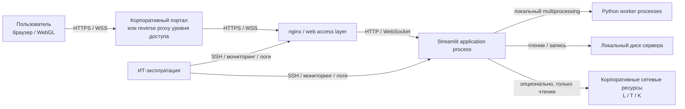

# Целевая техническая архитектура проекта «Конструктор прототипов траекторий»

Статус: версия для согласования с ИТ-службой  
Официальное наименование проекта: «Конструктор прототипов траекторий»  
Технический код проекта: `pywp`

---

## Таблица 7. Используемые сокращения

| Сокращение | Расшифровка |
| --- | --- |
| ACL | Access Control List, список контроля доступа |
| CPU | Центральный процессор |
| DEV | Среда разработки |
| DNS | Служба доменных имен |
| EDR | Средство мониторинга и защиты конечных узлов |
| HA | High Availability, высокая доступность |
| HTTPS | Защищенный HTTP |
| IAM | Система управления учетными записями и доступом |
| IPC | Межпроцессное взаимодействие |
| IT | Информационные технологии |
| NFS | Network File System |
| NTP | Сервис синхронизации времени |
| PKI | Корпоративная инфраструктура сертификатов |
| PROD | Продуктивная среда |
| RPO | Recovery Point Objective, допустимая точка потери данных |
| RTO | Recovery Time Objective, допустимое время восстановления |
| SMB | Server Message Block |
| SSO | Single Sign-On, единый вход |
| TEST / UAT | Тестовая / приемочная среда |
| TLS | Протокол криптографической защиты транспортного канала |
| VM | Виртуальная машина |
| WebSocket | Двусторонний сетевой протокол для интерактивной веб-сессии |
| WSS | WebSocket через TLS |
| ЦОД | Центр обработки данных |

## 2 ВВОДНАЯ ЧАСТЬ

### 2.1 ЦЕЛЬ ДОКУМЕНТА

Настоящий документ фиксирует целевую техническую архитектуру проекта «Конструктор прототипов траекторий» для корпоративного внедрения.

Документ нужен для того, чтобы ИТ-служба, эксплуатация, ИБ и заказчик одинаково понимали:

- как именно должна быть развернута система;
- из каких компонентов она состоит;
- как организуются доступ пользователей и публикация сервиса;
- откуда система получает исходные данные;
- какие серверные, сетевые и клиентские ресурсы требуются;
- как обеспечиваются устойчивость, мониторинг, резервное копирование и сопровождение;
- какие архитектурные ограничения есть у текущей версии.

В документе закрепляется базовый вариант реализации:

- одна Linux VM на среду;
- публикация приложения через корпоративный портал и/или reverse proxy уровня доступа;
- один `nginx` на узле приложения или эквивалентный reverse proxy по стандарту заказчика;
- один экземпляр приложения `Streamlit` на среду;
- локальный запуск расчетных Python-процессов на том же сервере;
- основной рабочий режим без встроенной прикладной аутентификации;
- файловый режим работы без обязательной внешней БД;
- возможность опционального доступа хотя бы на чтение к корпоративным сетевым ресурсам, отображаемым пользователям как `L:`, `T:`, `K:`.

Документ не заменяет собой:

- инструкцию администратора;
- инструкцию по развертыванию;
- программу и методику испытаний;
- формальные документы по ИБ и классификации системы;
- регламенты корпоративной IAM-инфраструктуры.

### 2.2 НАЗНАЧЕНИЕ ПРОЕКТИРУЕМОЙ СИСТЕМЫ

Проект «Конструктор прототипов траекторий» предназначен для инженерной работы с траекториями скважин.

Система выполняет следующие основные задачи:

- импортирует исходные данные и траектории из инженерных файлов, включая WELLTRACK и `.dev`;
- строит проектные траектории;
- выполняет пакетные расчеты;
- проводит anti-collision анализ;
- показывает результаты в 2D и 3D;
- формирует экспортные файлы для дальнейшей работы.

Технически система реализована как внутреннее веб-приложение на Python с интерфейсом на `Streamlit`.

Текущая реализация имеет следующие важные свойства:

- пользовательская сессия и текущее рабочее состояние живут в памяти процесса приложения;
- тяжелые расчеты запускаются этим же процессом в отдельных дочерних процессах;
- приложение автоматически выбирает режим выполнения: последовательно, в 2 процесса или в 4 процесса;
- часть сценариев при проблемах с пулом процессов переходит в последовательный режим;
- встроенной формы логина и собственной прикладной аутентификации в приложении нет;
- прямой интеграции с `Blitz`, `Keycloak` или иной конкретной IAM/SSO-системой на уровне кода приложения нет.

Базовый сценарий получения данных в текущей версии следующий:

1. пользователь открывает приложение из корпоративного портала или через защищенный корпоративный URL;
2. пользователь загружает исходные файлы в интерфейс приложения;
3. запускает расчет;
4. получает результат и, при необходимости, выгружает экспорт.

Дополнительно требуется предусмотреть возможность доступа хотя бы на чтение к корпоративным сетевым ресурсам, которые у пользователей отображаются как диски `L:`, `T:`, `K:`. Технически речь идет не о буквах дисков как таковых, а о соответствующих сетевых шарах или файловых ресурсах.

Во внутренней архитектуре:

- нет обязательной внешней базы данных;
- нет отдельного вычислительного кластера;
- нет постоянного централизованного хранилища бизнес-данных;
- нет прикладной зависимости от конкретного IAM-продукта.

Эти особенности определяют рекомендуемую схему внедрения: один экземпляр приложения на Linux-сервере за корпоративным уровнем доступа, локальный multiprocessing, файловый режим работы и восстановление среды за счет стандартных средств виртуализации, сервисного рестарта и резервного копирования.

## 3 ТЕХНИЧЕСКИЕ ТРЕБОВАНИЯ К СИСТЕМЕ

### 3.1 ТРЕБОВАНИЯ К ПРОИЗВОДИТЕЛЬНОСТИ И СТАБИЛЬНОСТИ СИСТЕМЫ

Система проектируется на контур до 15 пользователей.

Для production-среды фиксируются следующие базовые рабочие пределы:

- до 15 активных пользовательских веб-сессий;
- до 2 одновременных тяжелых расчетных операций в штатном режиме;
- параллельная работа пользователей с интерфейсом во время расчетов;
- один экземпляр приложения на среду;
- локальный расчетный контур на том же сервере;
- допустимая потеря активных сессий при рестарте приложения.

Три и более одновременных тяжелых расчета считаются выходом за штатный режим первой production-версии.

Целевые показатели приведены в таблице.

| Параметр | Значение | Пояснение |
| --- | --- | --- |
| Количество пользователей | до 15 | Целевой контур PROD |
| Тип доступа | веб-доступ через браузер | Без толстого клиента |
| Отзывчивость легких операций | до 3 секунд | Переходы по интерфейсу, просмотр, фильтрация |
| Одновременные тяжелые расчеты | до 2 | пакетный расчет и anti-collision |
| Количество экземпляров приложения | 1 | Базовый production-вариант |
| Доступность PROD | 99,5% в год | При штатной эксплуатации |
| RTO PROD | до 4 часов | Восстановление после отказа VM или сервиса |
| RPO по конфигурации и экспортам | до 24 часов | При ежедневном резервном копировании |
| Потеря активной сессии при рестарте приложения | допустима | Ограничение текущей архитектуры |

С точки зрения нагрузки операции системы делятся на три класса.

| Класс операции | Примеры | Нагрузка | Ожидаемое поведение |
| --- | --- | --- | --- |
| Легкие | открытие экрана, переключение вкладок, просмотр результатов | короткая нагрузка на CPU и память | интерфейс остается отзывчивым |
| Средние | импорт файла, подготовка данных, экспорт | смешанная нагрузка на CPU, память и диск | возможны короткие пиковые задержки |
| Тяжелые | пакетный расчет, anti-collision на крупном наборе данных | выраженная нагрузка на CPU и рост числа процессов | расчет выполняется без падения сервиса |

Под стабильностью в этом документе понимается не только доступность URL, но и нормальная работа всей цепочки:

- пользователь проходит корпоративный механизм доступа на портале или reverse proxy;
- открывает приложение без дополнительного логина в самом приложении;
- интерфейс отвечает и обрабатывает действия пользователя;
- расчеты выполняются без потери управляемости сервиса;
- при сбое расчетного пула поддерживаемые сценарии могут деградировать до последовательного выполнения;
- после сбоя система возвращается в рабочее состояние в пределах согласованного RTO.

Ключевой технический вывод по разделу: для текущей реализации production-схема должна опираться на один экземпляр `Streamlit` на Linux-сервере с контролируемым локальным multiprocessing, а не на несколько UI-инстансов с попыткой распределять состояние между ними.

## 4 ОПИСАНИЕ СТРУКТУРЫ И ТЕХНИЧЕСКАЯ РЕАЛИЗАЦИЯ

### 4.1 ГРАФИЧЕСКАЯ СХЕМА С ВЗАИМОСВЯЗЯМИ КОМПОНЕНТОВ СИСТЕМЫ

#### 1-й уровень. Узлы, каналы, пользователи

#### 2-й уровень. Среды

| Среда | Назначение | Размещение | Особенность |
| --- | --- | --- | --- |
| DEV | разработка и внутренняя инженерная проверка | отдельная VM | упрощенные требования по SLA |
| TEST / UAT | интеграционные, регрессионные и приемочные проверки | отдельная VM | максимально близка к PROD |
| PROD | рабочая эксплуатация | отдельная VM | доступ только из корпоративной сети |

#### 3-й уровень. Взаимодействие сред

Среды `DEV`, `TEST / UAT` и `PROD` изолированы друг от друга. Общего рабочего трафика между ними нет. Между средами перемещаются только артефакты релиза, согласованные конфигурации и тестовые наборы данных в рамках регламентированного процесса.

Практический смысл схемы:

- пользователь работает через корпоративный URL или ссылку на корпоративном портале;
- аутентификация выполняется на внешнем корпоративном контуре доступа;
- приложение не показывает отдельную форму логина;
- прямой доступ к внутреннему порту приложения извне не допускается;
- расчеты выполняются локально на сервере приложения;
- локальные временные и экспортные файлы хранятся на сервере;
- корпоративные сетевые ресурсы `L/T/K` рассматриваются как опциональный источник данных с доступом хотя бы на чтение.

### 4.2 ОПИСАНИЕ ТРЕБОВАНИЙ К РЕАЛИЗАЦИИ СЕРВЕРНОЙ ЧАСТИ

#### 4.2.1 Базовый архитектурный вариант

Серверная часть реализуется по следующей схеме:

- одна Linux VM на каждую среду;
- один экземпляр приложения `Streamlit` на среду;
- один `nginx` на узле приложения либо эквивалентный reverse proxy по стандарту заказчика;
- публикация через корпоративный портал и/или внешний reverse proxy уровня доступа;
- локальный запуск расчетных процессов на том же сервере;
- локальные каталоги для логов, временных файлов и экспортов;
- опциональный доступ к корпоративным сетевым файловым ресурсам `L/T/K` хотя бы на чтение;
- автоматический рестарт приложения через `systemd`;
- резервирование на уровне виртуализации, резервного копирования и быстрого восстановления.

Это не active-active кластер и не распределенный пул приложений. Это веб-приложение с состоянием пользовательской сессии внутри процесса и с локальным расчетным контуром, развернутое на одном сервере на среду.

#### 4.2.2 Обоснование выбора

Этот вариант выбран потому, что он лучше всего соответствует текущему устройству приложения.

1. Пользовательское состояние хранится в памяти процесса `Streamlit`.  
   Значит приложение не является веб-сервисом без состояния и требует привязки сессии к одному процессу.

2. Тяжелые расчеты запускаются локально через multiprocessing.  
   Значит вычислительный контур уже привязан к конкретному хосту.

3. В приложении нет собственной прикладной аутентификации.  
   Значит корректный способ защиты доступа - внешний корпоративный контур: портал, reverse proxy, IAM, сертификаты, смарт-карта.

4. В текущей версии нет обязательной внешней БД.  
   Значит основной сценарий работы - загрузка файлов, расчет и получение результата.

5. Доступ к корпоративным файловым ресурсам `L/T/K` нужен как полезная интеграционная возможность, но не как обязательный фундамент всей архитектуры.  
   На первом этапе достаточно предусмотреть доступ только на чтение.

6. Схема с несколькими экземплярами `Streamlit` не должна считаться базовой production-схемой без вынесенного вычислительного слоя и более явного внешнего хранения состояния.  
   Она усложняет эксплуатацию, но не решает базовое ограничение состояния, привязанного к процессу приложения.

Итог: один экземпляр приложения на одном Linux-сервере дает для этой версии системы лучший баланс между устойчивостью, управляемостью, стоимостью и архитектурной честностью.

#### 4.2.3 Размещение компонентов

| Компонент | Размещение | Назначение |
| --- | --- | --- |
| Корпоративный портал / внешний reverse proxy | контур доступа заказчика | точка публикации и аутентификации |
| VM среды | корпоративный ЦОД | основной узел среды |
| Linux | внутри VM | базовая серверная платформа |
| `nginx` | на узле приложения или на выделенном ingress-узле | HTTPS/WSS, маршрутизация, контроль доступа |
| `Streamlit application` | на том же узле | пользовательская сессия, UI, импорт, экспорт, запуск расчетов |
| Процессы расчета | на том же узле | ресурсоемкие расчеты |
| Локальный диск | на том же узле | логи, временные файлы, экспорты |
| Корпоративные сетевые ресурсы `L/T/K` | существующая инфраструктура заказчика | внешние файловые источники данных, доступ только на чтение на первом этапе |

#### 4.2.4 Требования к дата-центру и хостовой платформе

| Требование | Значение |
| --- | --- |
| Тип размещения | корпоративный ЦОД |
| Тип платформы | отказоустойчивая виртуализация |
| Питание, сеть, хранение | по стандарту ЦОД |
| Резервное копирование VM | обязательно |
| Быстрый рестарт VM | обязательно |
| Системное время | синхронизация по NTP |
| DNS | корпоративный DNS |

#### 4.2.5 Требования к сетевому уровню

| Параметр | Значение |
| --- | --- |
| Пользовательский доступ | только из корпоративной сети |
| Публикация сервиса | через корпоративный портал и/или reverse proxy |
| Пользовательский протокол | `HTTPS / WSS` |
| Прямой доступ к внутреннему порту приложения | запрещен |
| Скорость uplink сервера | 1 Gbps |
| Доступ к DNS и NTP | обязателен |
| Доступ к корпоративным файловым ресурсам `L/T/K` | требуется хотя бы на чтение, если доступ организуется со стороны сервера |

#### 4.2.6 Требования к системе коммутации

| Параметр | Значение |
| --- | --- |
| Класс оборудования | управляемая корпоративная L2/L3 сеть |
| Скорость серверных портов | не ниже 1 Gbps |
| Мониторинг сетевого уровня | обязателен |
| Резервирование сети | по стандарту площадки |

#### 4.2.7 Структура каждой среды

| Среда | Схема | CPU | RAM | Disk |
| --- | --- | --- | --- | --- |
| DEV | `portal/reverse proxy + nginx + 1 Streamlit + локальные процессы расчета` | 4 vCPU | 16 GB | 80-100 GB SSD |
| TEST / UAT | `portal/reverse proxy + nginx + 1 Streamlit + локальные процессы расчета` | 8 vCPU | 16-32 GB | 100-150 GB SSD |
| PROD | `portal/reverse proxy + nginx + 1 Streamlit + локальные процессы расчета` | 16 vCPU | 32-64 GB | 100-200 GB SSD/NVMe |

Во всех средах схема одинакова. Меняется только объем ресурсов.

#### 4.2.8 Платформа исполнения

Серверная реализация фиксируется в следующем виде:

| Объект | Реализация |
| --- | --- |
| ОС | Linux LTS |
| Менеджер сервиса | `systemd` |
| Учетная запись приложения | отдельная непривилегированная служебная учетная запись |
| Экземпляры приложения | один сервис `pywp-app` на среду |
| Внутренний порт приложения | согласованный локальный порт, например `127.0.0.1:8501` |
| Логи приложения | `journald` и централизованный сбор логов |
| Политика рестарта | автоматический рестарт сервиса |
| Обновление версии | через релизный пакет и контролируемый рестарт |

Контейнеризация в базовую схему не входит, но может быть рассмотрена отдельно как способ упаковки, а не как изменение прикладной архитектуры.

#### 4.2.9 Настройки обратного прокси

`nginx` настраивается как внутренняя веб-точка публикации приложения или как компонент контура доступа, если это соответствует стандарту заказчика.

Обязательные свойства конфигурации:

- прием `HTTPS` на `443/TCP`;
- поддержка `WebSocket`;
- проксирование на один внутренний экземпляр приложения;
- `proxy_http_version 1.1`;
- заголовки `Upgrade` и `Connection`;
- увеличенные `proxy_read_timeout` и `proxy_send_timeout` для длинных расчетов;
- ограничение доступа по корпоративной сети;
- логирование обращений и ошибок;
- TLS-сертификат из корпоративного PKI-контура.

Лимит на размер загружаемых файлов фиксируется в конфигурации `nginx` и соответствует принятому в эксплуатации пределу для импортируемых инженерных файлов.

#### 4.2.10 Границы базовой архитектуры

Эта архитектура закрывает текущий производственный контур системы:

- до 15 пользователей;
- до 2 одновременных тяжелых расчетов;
- один сервер на среду;
- один экземпляр приложения;
- локальный расчетный контур;
- работа без собственной прикладной аутентификации;
- файловый режим без обязательной внешней БД;
- публикация через корпоративный портал / reverse proxy;
- возможность доступа к сетевым ресурсам `L/T/K` хотя бы на чтение.

Это и есть штатный режим первой production-версии.

### 4.3 ФУНКЦИОНАЛЬНОЕ НАЗНАЧЕНИЕ КОМПОНЕНТОВ

| Компонент | Что делает | Где хранит состояние | Главный ресурс |
| --- | --- | --- | --- |
| Корпоративный портал / reverse proxy уровня доступа | публикует ссылку на систему и применяет корпоративный механизм аутентификации | во внешнем корпоративном контуре | сеть и IAM-интеграция |
| Браузер пользователя | показывает интерфейс, таблицы, графики и 3D | на рабочем месте пользователя | RAM браузера и WebGL |
| `nginx` | принимает HTTPS и WSS, проксирует запросы в приложение | служебная конфигурация маршрутизации | сеть и небольшой CPU |
| `Streamlit application` | ведет пользовательскую сессию, хранит текущее состояние, запускает расчеты | в памяти процесса приложения | RAM и CPU управления |
| Python calculation core | строит траектории, выполняет пакетный расчет и anti-collision | в процессе приложения и расчетных процессах | CPU |
| Процессы расчета | параллельно выполняют тяжелые расчеты | краткоживущие процессы | CPU и RAM |
| Локальный диск | хранит логи, временные файлы и экспорты | на сервере | дисковое пространство |
| Корпоративные сетевые ресурсы `L/T/K` | предоставляют внешние файловые данные | за пределами приложения | сетевой I/O и права доступа |
| Средства мониторинга | собирают метрики и логи | во внешнем корпоративном контуре | сеть и сервисные агенты |

Компоненты подобраны по простому принципу: аутентификация остается на корпоративном уровне доступа, интерфейс работает в браузере, приложение обрабатывает пользовательскую сессию и расчеты, а внешние файлы поступают либо через загрузку в браузере, либо через согласованный доступ только на чтение к сетевым ресурсам.

### 4.4 ОПИСАНИЕ И ТЕХНОЛОГИИ ОТКАЗОУСТОЙЧИВОСТИ

Надежность системы строится на простой и прозрачной схеме:

- одна стабильная VM;
- один веб-контур публикации;
- один экземпляр приложения;
- локальный расчетный контур;
- автоматический рестарт сервиса;
- резервное копирование;
- быстрое восстановление VM.

Для текущей версии это реалистичнее и честнее, чем искусственная схема с несколькими UI-инстансами без внешнего хранения состояния и без отдельного вычислительного слоя.

| Компонент | Как обеспечивается устойчивость |
| --- | --- |
| VM / сервер | отказоустойчивая виртуализация и штатное восстановление VM |
| `nginx` | системный сервис, автозапуск, перезапуск при отказе |
| `Streamlit application` | отдельный `systemd`-сервис, проверка доступности и автоматический рестарт |
| Процессы расчета | локальный пул процессов и контролируемый перезапуск сценария |
| Локальный диск | резервное копирование артефактов и контроль свободного места |
| Конфигурация среды | хранение в релизном пакете и резервной копии |
| Корпоративный контур доступа | обеспечивается средствами заказчика |

Активная пользовательская сессия после падения приложения не сохраняется. Пользователь после рестарта подключается заново.

Матрица типовых отказов:

| Сценарий отказа | Что видит пользователь | Что делает система | Что делает эксплуатация |
| --- | --- | --- | --- |
| Сбой процесса расчета | ошибка конкретного расчета или его замедление | расчет повторяется по сценарию приложения; в поддерживаемых сценариях возможен переход в последовательный режим | проверяет лог и повторяет запуск сценария |
| Сбой приложения `Streamlit` | все активные сессии текущей среды обрываются | `systemd` перезапускает сервис | проверяет успешный старт сервиса и логи |
| Сбой `nginx` | веб-интерфейс временно недоступен | сервис перезапускается | проверяет конфигурацию и доступность URL |
| Сбой VM | среда недоступна полностью | восстановление идет на уровне виртуализации | запускает план восстановления VM |
| Потеря доступа к `L/T/K` | недоступен соответствующий внешний источник файлов | приложение сохраняет возможность работать с ручной загрузкой файлов | проверяет сетевой путь и права доступа |
| Переполнение диска | ошибки логов, временных файлов или экспорта | сервис продолжает работу до исчерпания ресурса | очищает каталог, восстанавливает запас места |
| Разрыв сети у пользователя | текущая сессия прерывается | сервер продолжает работу | пользователь подключается заново |

Главный вывод по разделу: готовность к production для этой системы означает предсказуемое развертывание с одним экземпляром приложения, внешнюю корпоративную аутентификацию, локальный расчетный контур и быстрое восстановление среды, а не многосерверную балансировку сессий.

### 4.5 ОПИСАНИЕ ВЗАИМОДЕЙСТВИЯ ПОЛЬЗОВАТЕЛЕЙ С СИСТЕМОЙ

Пользователь открывает систему по корпоративному HTTPS-адресу или по ссылке на корпоративном портале. Аутентификация выполняется на корпоративном контуре доступа, например через действующий механизм входа с использованием смарт-карты, PIN-кода и корпоративного сертификата. После этого пользователь попадает в приложение без отдельной формы логина внутри самого приложения.

Все расчеты выполняются на сервере. На рабочем месте пользователя остается только браузер, визуализация и взаимодействие с интерфейсом.

Источники данных для пользователя в текущей версии:

- локальная загрузка инженерных файлов через браузер;
- открытие файлов из согласованных корпоративных сетевых ресурсов `L/T/K`, если соответствующий доступ организован на стороне сервера или через файловый контур пользователя;
- экспорт результатов из приложения пользователю или в согласованный каталог.

#### Требования к клиентским рабочим местам

| Параметр | Значение |
| --- | --- |
| ОС | Windows 10/11 или корпоративный Linux |
| Браузер | Microsoft Edge или Google Chrome актуальной корпоративной версии |
| RAM рабочего места | 8 GB минимум, 16 GB штатно |
| Разрешение экрана | 1920x1080 |
| Графика | WebGL и аппаратное ускорение браузера включены |
| Дополнительное ПО | не требуется |
| Средство входа в корпоративный портал | по стандарту заказчика, включая смарт-карту и PIN при наличии такого контура |

#### Типы клиентов и порты

| Тип клиента | Назначение | Протокол и порт |
| --- | --- | --- |
| Браузер пользователя | основная работа с системой | `HTTPS / WSS`, `443/TCP` |
| Административный доступ | сопровождение сервера | `SSH`, `22/TCP` |

#### Роли пользователей

| Роль | Что делает |
| --- | --- |
| Инженер-пользователь | импортирует данные, запускает расчеты, смотрит результаты, делает экспорт |
| Пользователь-эксперт | работает с крупными наборами данных и 3D |
| Системный администратор | сопровождает контур публикации, приложение, логи, бэкапы и мониторинг |

Мобильный доступ в целевой контур не входит. Рабочий сценарий системы - настольный браузер в корпоративной сети.

### 4.6 ЛИЦЕНЗИРОВАНИЕ СЕРВЕРНОЙ И КЛИЕНТСКОЙ ЧАСТЕЙ

| Компонент | Тип лицензирования | Примечание |
| --- | --- | --- |
| Прикладной код проекта | внутренний / договорной | поставляется как часть проекта |
| Python | ПО с открытым исходным кодом | отдельная серверная лицензия не требуется |
| Streamlit | ПО с открытым исходным кодом | входит в состав прикладного стека |
| `nginx` | ПО с открытым исходным кодом | используется как обратный прокси |
| Библиотеки `numpy`, `pandas`, `scipy`, `plotly`, `pyproj`, `py7zr` | ПО с открытым исходным кодом | фиксируются в перечне компонентов с открытым исходным кодом |
| ОС, виртуализация, backup, мониторинг, EDR | по стандартам заказчика | относятся к инфраструктурному контуру |
| Корпоративный портал / IAM / PKI | по стандартам заказчика | приложением отдельно не лицензируются |
| Клиентская часть | отдельная лицензия приложения не требуется | используется корпоративный браузер |

С точки зрения внедрения лицензирование прикладного стека выглядит просто: приложение не требует отдельного IAM-продукта внутри себя и опирается на существующий корпоративный контур доступа.

### 4.7 ПОРЯДОК СЕТЕВОГО ВЗАИМОДЕЙСТВИЯ КОМПОНЕНТОВ СИСТЕМЫ

| Источник | Назначение | Протоколы | Порт | Назначение соединения |
| --- | --- | --- | --- | --- |
| Рабочее место пользователя | корпоративный портал / reverse proxy | `HTTPS`, `WSS` | `443/TCP` | пользовательский доступ и аутентификация |
| Корпоративный портал / reverse proxy | `nginx` или приложение | `HTTPS`, `WSS` | `443/TCP` или согласованный внутренний порт | публикация сервиса |
| `nginx` | `Streamlit application` | `HTTP`, `WebSocket` | `127.0.0.1:8501` или согласованный локальный порт | локальная передача запросов |
| `Streamlit application` | процессы расчета | локальный IPC / multiprocessing | не сетевой канал | запуск и обмен с расчетными процессами |
| сервер | DNS | `UDP/TCP` | `53` | служебная связность |
| сервер | NTP | `UDP` | `123` | синхронизация времени |
| `Streamlit application` | корпоративные сетевые ресурсы `L/T/K` | `SMB3` и/или `NFSv4` | по стандарту файлового сервиса | чтение внешних файловых данных |
| Средства мониторинга | сервер и сервисы | по стандарту заказчика | по стандарту заказчика | сбор метрик и логов |
| Административный сегмент | сервер | `SSH` | `22/TCP` | сопровождение сервера |

Сетевой принцип у системы простой:

- наружу публикуется только корпоративный HTTPS-вход;
- прямой доступ к внутреннему порту приложения не допускается;
- трафик между `nginx` и приложением остается внутри узла или доверенного внутреннего контура;
- отдельного сетевого канала для расчетных процессов нет;
- доступ к `L/T/K` нужен только как файловый источник данных и на первом этапе может быть только на чтение.

## 5 БЕЗОПАСНОСТЬ

Система размещается во внутренней корпоративной сети и не публикуется в интернет напрямую. Защита строится на наборе мер, подходящих для внутренней инженерной системы:

- доступ только из корпоративной сети;
- аутентификация на корпоративном контуре доступа, а не внутри приложения;
- использование действующего механизма корпоративного входа, включая смарт-карту, PIN и сертификат, если это стандартная схема заказчика;
- HTTPS и WebSocket через TLS;
- отдельная сервисная учетная запись;
- журналирование административных действий;
- централизованный мониторинг;
- резервное копирование;
- ограничение доступа к внешним файловым ресурсам `L/T/K` по минимально необходимым правам.

Формальная классификация по требованиям ФЗ-152 и внутренним стандартам ИБ оформляется в корпоративном процессе согласования. Техническая схема системы построена так, чтобы эти меры можно было применить без перестройки архитектуры.

### 5.1 БЕЗОПАСНОСТЬ АВТОРИЗАЦИИ И УЧЕТНЫХ ЗАПИСЕЙ

| Область | Реализация |
| --- | --- |
| Аутентификация пользователей | на уровне корпоративного портала, reverse proxy или IAM-контура |
| Прикладная аутентификация внутри системы | отсутствует |
| Прямая интеграция приложения с `Blitz`, `Keycloak` и аналогичными системами | отсутствует в текущей версии |
| Допустимый сценарий использования корпоративной IAM | через внешний контур доступа без изменения кода приложения |
| Авторизация пользователей | корпоративные группы доступа, ACL и правила публикации сервиса |
| Локальные пользовательские учетные записи на сервере | не используются для работы с приложением |
| Учетная запись приложения | отдельная непривилегированная служебная учетная запись |
| Доступ сервисной учетной записи к `L/T/K` | по возможности только на чтение, только при необходимости серверного доступа к этим ресурсам |
| Административный доступ | только из административного сегмента |
| Доступ к ОС | `SSH` с журналированием |
| Секреты и конфигурация | не хранятся в исходном коде; размещаются в защищенных конфигурационных файлах среды |
| Защита хоста | корпоративный EDR/антивирус и базовые настройки усиления безопасности |

Организационные правила по этому разделу:

- общие анонимные административные учетные записи не используются;
- права доступа выдаются по именованным учетным записям;
- изменения конфигурации фиксируются и воспроизводятся;
- парольная политика, срок действия учетных данных и использование смарт-карт определяются корпоративным IAM-контуром;
- если корпоративный портал уже реализует вход по сертификату и PIN, повторная форма логина внутри приложения не требуется.

### 5.2 ЗАЩИЩЕННАЯ ПЕРЕДАЧА ИНФОРМАЦИИ МЕЖДУ КОМПОНЕНТАМИ СИСТЕМЫ

| Соединение | Протоколы | Порт | Защита |
| --- | --- | --- | --- |
| Пользователь -> корпоративный портал / reverse proxy | `HTTPS`, `WSS` | `443/TCP` | обязательный TLS |
| Корпоративный портал / reverse proxy -> `nginx` / приложение | `HTTPS`, `WSS` или согласованный внутренний протокол | по схеме публикации | по стандарту заказчика |
| `nginx` -> `Streamlit application` | `HTTP`, `WebSocket` | локальный внутренний порт | локальный доверенный контур |
| Приложение -> `L/T/K` | `SMB3` и/или `NFSv4` | по стандарту файлового сервиса | только во внутреннем доверенном контуре |
| Администратор -> сервер | `SSH` | `22/TCP` | доступ только из административного сегмента |

Требования к защищенной передаче:

- используется TLS версии, разрешенной корпоративным стандартом;
- сертификат выпускается или утверждается корпоративным PKI-контуром;
- внешний незашифрованный HTTP-доступ отсутствует;
- административный доступ ограничен по ACL и журналируется;
- при доступе к `L/T/K` используются только согласованные внутренние сетевые пути и сервисные права.

## 6 ТЕХНИЧЕСКОЕ ОБСЛУЖИВАНИЕ

### 6.1 РЕЗЕРВНОЕ КОПИРОВАНИЕ

| Ресурс | Что сохраняется | Период хранения | Частота |
| --- | --- | --- | --- |
| Релизные артефакты | пакет поставки приложения | не менее 90 дней | на каждый релиз |
| Конфигурация среды | `nginx`, `systemd`, конфигурационные файлы среды | не менее 90 дней | при каждом изменении |
| Экспортные каталоги | результаты, которые подлежат хранению | 30-90 дней | ежедневно |
| Резервная копия VM | образ среды | по регламенту площадки | ежедневно |
| Логи | системные и прикладные логи | 30-90 дней | ежедневно с ротацией |

В резервное копирование не входят:

- активные веб-сессии пользователей;
- содержимое оперативной памяти процесса приложения;
- краткоживущие процессы расчета;
- внешние данные на корпоративных сетевых ресурсах `L/T/K`, так как они не являются хранилищем приложения.

Логика восстановления по этому разделу:

1. сначала восстанавливается сервер и сервисы среды;
2. затем поднимаются `nginx` и приложение;
3. затем проверяются доступность URL, выполнение базового сценария и каталоги экспорта;
4. отдельно, при необходимости, проверяется связность с `L/T/K`;
5. пользователь после аварии подключается заново и продолжает работу.

### 6.2 АВТОМАТИЧЕСКИЙ МОНИТОРИНГ

| Объект | Порог | Уровень |
| --- | --- | --- |
| Недоступность `nginx` | сервис не отвечает | критический |
| Недоступность приложения `Streamlit` | сервис не отвечает | критический |
| CPU сервера | более 95% в течение 5 минут | критический |
| CPU сервера | более 85% в течение 15 минут | предупреждение |
| RAM сервера | более 95% | критический |
| RAM сервера | более 85% | предупреждение |
| Свободное место на диске | менее 10% | критический |
| Свободное место на диске | менее 20% | предупреждение |
| Количество рестартов приложения | более 3 в сутки | предупреждение |
| Ошибки расчетов | рост относительно обычного уровня | предупреждение |
| Время тяжелых расчетов | заметный рост относительно штатного уровня | предупреждение |
| Недоступность `L/T/K` при включенной интеграции | ресурс не читается | предупреждение |

Мониторинг собирается из четырех источников:

- системные метрики Linux-сервера;
- статус и логи `nginx`;
- статус и логи приложения;
- служебные метрики расчетных сценариев.

Для production-среды достаточно следующих практичных дашбордов:

- доступность внешнего URL;
- состояние веб-сервиса и приложения;
- CPU, RAM и диск;
- ошибки и длительность расчетов;
- доступность сетевых ресурсов `L/T/K`, если они включены в рабочий контур.

### 6.3 РЕГУЛЯРНЫЕ ОПЕРАЦИИ ОБСЛУЖИВАНИЯ

| Компонент | Операция | Периодичность |
| --- | --- | --- |
| Linux | обновления безопасности | по корпоративному регламенту |
| `nginx` | проверка конфигурации, обновление, ротация логов | ежемесячно и по релизам |
| Приложение | обновление версии и контролируемый рестарт | по релизному плану |
| Окружение Python | обновление зависимостей | по релизам |
| Экспортные каталоги | очистка старых файлов | еженедельно |
| План резервного копирования | проверка восстановления | не реже 1 раза в квартал |
| Производительность | контроль базовых сценариев | перед production-релизом |
| Доступ к `L/T/K` | проверка сетевой доступности и прав | по регламенту эксплуатации, если интеграция включена |

Результат регулярного обслуживания должен быть понятным и проверяемым:

- приложение запускается после рестарта без ручной сборки среды;
- конфигурация среды известна и воспроизводима;
- публикация через корпоративный URL остается рабочей;
- на диске есть запас места;
- TEST / UAT повторяет production-схему;
- восстановление из резервной копии реально проверено.

### 6.4 РЕГЛАМЕНТНЫЕ ОПЕРАЦИИ КОРПОРАТИВНОГО ИНСТРУМЕНТАЛЬНОГО ПАКЕТА

Пункт для данной системы не применяется. Проект не относится к системам `1С` и не использует соответствующий корпоративный инструментальный пакет.

## 7 ИТОГОВАЯ СИСТЕМА

### 7.1 СТАБИЛЬНОСТЬ СИСТЕМЫ

#### 7.1.1 ТРЕБОВАНИЯ К СТАБИЛЬНОСТИ

| Среда | Доступность | RTO | Комментарий |
| --- | --- | --- | --- |
| DEV | по внутреннему регламенту команды | по регламенту команды | среда разработки |
| TEST / UAT | 99,0% в рабочее время | до 8 часов | среда проверки релизов |
| PROD | 99,5% в год | до 4 часов | рабочая эксплуатация |

Ограничения стабильности для текущей версии системы:

- рестарт приложения обрывает активные пользовательские сессии;
- пользовательская сессия не переносится между процессами или узлами;
- тяжелые расчеты конкурируют за CPU в пределах одного сервера;
- отказ VM остается полной недоступностью среды;
- штатный режим системы ограничен двумя одновременными тяжелыми расчетами;
- недоступность `L/T/K` не должна останавливать весь сервис, но влияет на сценарии чтения внешних файлов из этих ресурсов.

В показатель доступности не включаются:

- согласованные окна регламентного обслуживания;
- аварии на стороне пользовательского рабочего места;
- локальные проблемы браузера;
- внешние сбои корпоративной сети вне зоны ответственности системы;
- сбои внешних файловых ресурсов `L/T/K`, если при этом базовый файловый сценарий через ручную загрузку остается доступным.

#### 7.1.2 ПОДТВЕРЖДЕНИЕ СТАБИЛЬНОСТИ ТЕСТАМИ

Стабильность системы подтверждается следующими обязательными тестами:

1. проверка запуска приложения после развертывания;
2. тест 15 одновременных пользовательских сессий;
3. тест прохождения доступа через корпоративный портал / reverse proxy;
4. тест 2 одновременных тяжелых расчетов;
5. тест контролируемого рестарта приложения;
6. тест непрерывной работы в течение 8 часов;
7. тест восстановления VM из резервной копии;
8. тест импорта, экспорта и 3D-визуализации на целевых рабочих местах;
9. тест доступа к `L/T/K` на чтение, если эта интеграция включена в целевой контур.

Для каждого теста фиксируются:

- входные данные;
- число пользователей;
- длительность сценария;
- среднее и пиковое потребление CPU, RAM и диска;
- ошибки в логах;
- итоговый результат теста.

Минимальные критерии приемки:

| Тест | Критерий успеха |
| --- | --- |
| Доступность системы | пользователь открывает URL и попадает в приложение через корпоративный контур доступа |
| Приложение после релиза | сервис запущен и принимает трафик |
| 15 сессий | сервис остается доступным и управляемым |
| 2 тяжелых расчета | расчеты завершаются без падения всего сервиса |
| Контролируемый рестарт | сервис поднимается в пределах согласованного времени |
| Восстановление VM | система поднимается с рабочей конфигурацией и доступным URL |
| `L/T/K` | при включенной интеграции приложение или сервер читают согласованные сетевые ресурсы |

#### 7.1.3 ИТОГОВЫЕ РАСЧЕТЫ ТЕХНИЧЕСКИХ ТРЕБОВАНИЙ К ОБОРУДОВАНИЮ НА 15 ПОЛЬЗОВАТЕЛЕЙ

Итоговая матрица серверных ресурсов:

| Среда | CPU | RAM | Disk |
| --- | --- | --- | --- |
| DEV | 4 vCPU | 16 GB | 80-100 GB SSD |
| TEST / UAT | 8 vCPU | 16-32 GB | 100-150 GB SSD |
| PROD | 16 vCPU | 32-64 GB | 100-200 GB SSD/NVMe |

Размер production-среды выбран из реального характера нагрузки приложения и из выбранной схемы с одним экземпляром приложения.

1. Один тяжелый расчет в нагруженном сценарии может использовать до 4 процессов расчета.
2. Два тяжелых расчета одновременно дают до 8 активных расчетных процессов.
3. Параллельно с этим на сервере постоянно работают:
   - `nginx`;
   - приложение `Streamlit`;
   - системные службы;
   - пользовательские сессии;
   - мониторинг и логирование.
4. Среда должна сохранять запас емкости для устойчивой работы интерфейса, визуализации и I/O с файлами.

Отсюда итоговый размер PROD:

- `16 vCPU` для приложения, расчетных процессов и эксплуатационного запаса;
- `32 GB RAM` как минимально разумное значение;
- `64 GB RAM` как предпочтительный объем при тяжелых наборах данных и активной 3D-работе;
- `100-200 GB SSD/NVMe` для системы, логов, временных файлов и экспортов;
- `Linux LTS` как серверная платформа.

Это не теоретический минимум, а нормальный рабочий размер для первой production-версии.

#### 7.1.4 ПРОГНОЗ РОСТА СИСТЕМЫ

Рост системы идет по понятной последовательности.

Сначала увеличиваются ресурсы одного сервера:

- больше CPU;
- больше RAM;
- более быстрый диск.

Следующий шаг - выделение внешнего вычислительного слоя для расчетных задач.

После этого появляется смысл отдельно масштабировать UI-контур и, при необходимости, более глубоко перерабатывать хранение состояния и модель интеграций.

Практическая карта роста:

| Этап | Признак | Действие |
| --- | --- | --- |
| Текущий | до 15 пользователей, один экземпляр приложения, 2 тяжелых расчета | один сервер, один `nginx`, один `Streamlit`, локальный multiprocessing |
| Рост нагрузки | CPU стабильно загружен, расчеты становятся длиннее | вертикальное увеличение ресурсов сервера |
| Следующий архитектурный этап | тяжелых расчетов становится больше, чем выдерживает локальный контур | вынос расчетов в отдельный вычислительный слой |
| Рост интеграций | появляется постоянная БД, растет число внешних источников, нужен более сложный обмен данными | выделение явного слоя интеграции и хранения |
| Дальнейшее масштабирование интерфейса | требуется несколько UI-инстансов и более жесткие требования по доступности | переработка state-management и модели публикации |

Итоговый архитектурный вывод:

Для проекта «Конструктор прототипов траекторий» на текущем этапе правильная production-схема выглядит так: один Linux-сервер на среду, публикация через корпоративный портал или reverse proxy, один экземпляр `Streamlit`, локальные расчетные процессы, отсутствие встроенной прикладной аутентификации, файловый режим работы без обязательной внешней БД, опциональный доступ только на чтение к корпоративным сетевым ресурсам `L/T/K`, мониторинг и резервное копирование. Это рабочий и архитектурно согласованный вариант внедрения для существующей версии приложения.
