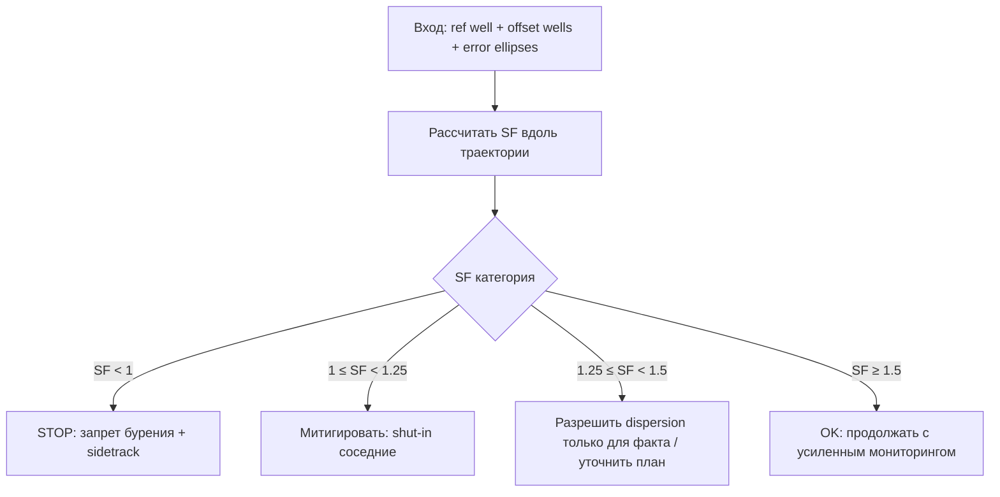
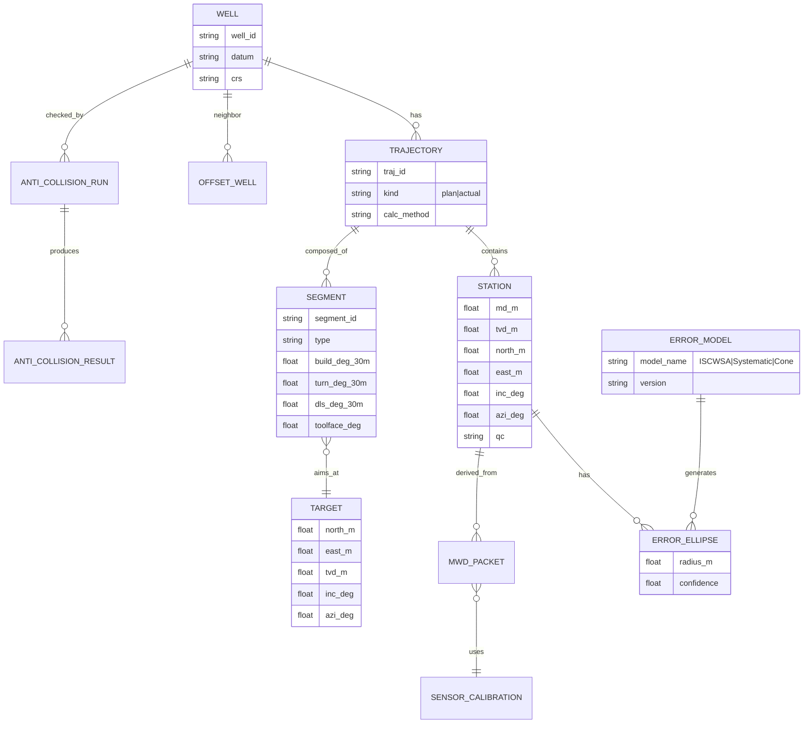

# Методологическая библиотека для AI‑агента Codex по направленному бурению и моделированию траектории

## Резюме и рамки применения

Этот «справочник‑библиотека методов» конвертирует содержание предоставленного руководства/мануала по направленному бурению (в текущей поставке — академический мануал по **Advanced Trajectory Modelling**, ориентированный на расчетные модели и функции траекторного планирования) в **DRY, модульный и переиспользуемый набор спецификаций** для AI‑агента, который помогает разрабатывать программные модули: планирование траектории, расчет координат, обработка MWD‑измерений, моделирование ошибок (error ellipse), антиколлизия и управляемые решения (decisioning). citeturn6view0turn19view0

В мануале четко разделены две фазы бурения: **планирование** и **исполнение/съемка (surveying)**. citeturn19view0 Общая программная архитектура в отраслевых инструментах (на примере Compass) декомпозируется на: **software model** (полный пакет), **calculation model/method** (математическая модель для координат между точками), **function models** (пользовательские функции, которые из входных параметров строят сегменты траектории). citeturn19view0

Ключевая инженерная линия мануала: траектория строится **сегментами** (tangent, 3D/2D curvature), каждая точка траектории имеет координаты **North/East/TVD** (N/E/Z), а ориентация в пространстве задается **инклинацией** и **азимутом**. citeturn6view0turn13view0 Мануал выделяет расчетные методы (tangential, balanced tangential, minimum curvature, radius of curvature, constant turn rate / exact departures, constant curvature) и указывает, что **minimum curvature** широко применяют в съемке, а **constant turn rate / exact departures** используется в планировании и фактически является базовым в планировщиках вроде Compass. citeturn6view0turn8view0turn11view1turn11view0

**Локальная копия файла, предоставленная вами (для трассируемости артефактов):** fileciteturn0file0

---

## Нормализованная онтология и карта руководства

### Нормализованные термины, типы, единицы и инварианты

В таблице ниже — «ядро» онтологии (минимальный набор сущностей/полей), который рекомендуется закрепить в коде как **канонический словарь** (например, в виде `dataclasses`/Pydantic‑моделей, JSON Schema и словаря единиц измерения). Термины и единицы приводятся по номенклатуре мануала. citeturn19view0turn13view0

| Термин (канон) | Синонимы в данных/индустрии | Тип | Единицы | Допустимый диапазон/инварианты | Где используется |
|---|---|---:|---|---|---|
| `MD` | Measured Depth | число | м (или ft) | `MD` монотонно возрастает | станции, сегменты, отчеты citeturn19view0turn17view0 |
| `TVD` (`Z`) | True Vertical Depth | число | м | обычно `TVD ≤ MD` | 3D‑координаты, тангенс/кривые citeturn19view0turn13view0turn14view1 |
| `N`, `E` | Northing/Easting | число | м | система координат на датуме | цель, антиколлизия, итог citeturn13view0turn8view0 |
| `I` | Inclination | число | град (°) | **[0, 90]** в базовой постановке мануала | ориентация, DLS, расчеты citeturn13view0turn19view0 |
| `A` | Azimuth | число | град (°) | **[0, 360)** (нормализация обязательна) | ориентация, повороты, зоны citeturn16view0turn15view3 |
| `B` | Build Rate | число | °/30 м | знак определяет набор/сброс инклинации | constant turn rate, DLS citeturn19view0turn13view0turn16view0 |
| `T` | Turn Rate | число | °/30 м | может быть отрицательным (CW/CCW) | азимут, выбор «короткого пути» citeturn13view0turn16view0turn15view2 |
| `CL` | Curve Length | число | м | `CL ≥ 0` | вычисление сегментов citeturn19view0turn16view0 |
| `φ` | Dogleg Angle | число | град (°) | геометрический угол между станциями | DLS, min curvature citeturn13view0turn11view1 |
| `DLS` (`D`) | Dogleg Severity | число | °/30 м | ограничение по оборудованию/рискам | планирование, контроль рисков citeturn13view0turn12view0 |
| `γ` | Toolface Angle / TFO | число | град (°) | трактовка зависит от high‑side/севера | dogleg toolface, steering citeturn19view0turn11view3 |
| `SF` | Separation Factor | число | безразмерно | пороги из табл. 6.2 | антиколлизия и решения citeturn8view0turn10view0 |
| `e_r`, `e_o` | Error radii | число | м | радиусы эллипсов неопределенности | SF, риск‑оценка citeturn8view0turn9view0 |
| `Gx,Gy,Gz` | акселерометр | число | mG | три оси | расчет `I` citeturn17view0turn19view0 |
| `Mx,My,Mz` | магнитометр | число | nT | три оси | расчет `A` citeturn17view0turn19view0 |

**Нормализация углов (рекомендация для агента):** хранить `A` всегда в диапазоне `[0, 360)` и централизовать функцию `normalize_azimuth_deg`. Мануал прямо предупреждает, что переход через север (0/360) приводит к отрицательным или >360 значениям и требует обработки. citeturn16view0turn15view3

### Карта (иерархия) разделов мануала как «индекс модулей»

Эта карта нужна агенту для: (a) маршрутизации запросов разработчика по разделам; (b) линковки требований ↔ формул ↔ тестов; (c) трассируемости.

В мануале структура верхнего уровня включает: **Well Planning → Software model → Calculation Methods/Models → Functions → Drilling Operation (Surveying, Error Modeling, Anti‑collision) + приложения с деривациями и кодом**. citeturn18view0turn18view2turn7view3

```mermaid
flowchart TD
  M[Мануал: Advanced Trajectory Modelling] --> WP[Well Planning]
  M --> SM[Software model]
  M --> CM[Calculation Methods/Models]
  M --> FN[Functions]
  M --> OP[Drilling Operation]
  M --> APP[Appendices]

  WP --> WP1[Требования к моделям траектории]
  WP --> WP2[База: I/A/DLS, сегменты (tangent/curves)]

  CM --> CM1[Tangential / Balanced Tangential]
  CM --> CM2[Minimum Curvature]
  CM --> CM3[Radius of Curvature]
  CM --> CM4[Exact Departures / Constant Turn Rate]
  CM --> CM5[Constant Curvature (обсуждение)]

  FN --> F1[Build&Turn (по I/A/TVD/Point)]
  FN --> F2[Tangent]
  FN --> F3[Dogleg Toolface]
  FN --> F4[Curve-to-Tangent-to-Target]
  FN --> F5[Build&Turn с финальными I и A]
  FN --> F6[Build&Turn+Tangent с финальными параметрами]

  OP --> S1[MWD: сенсоры и расчет I/A]
  OP --> S2[Error modeling: Cone/Systematic/ISCWSA]
  OP --> S3[Anti-collision + Separation Factor]

  APP --> A1[Derivations]
  APP --> A2[Program Code (Appendix B)]
  APP --> A3[Примеры результатов/Survey run]
```

---

## Операционные процедуры и деревья решений

Ниже — «операционные» decisioning‑модели, которые агент может применять как **исполняемые политики** (policy‑as‑code): что считать, чем считать, когда считать недопустимым, и какие fallback‑стратегии использовать.

### Выбор расчетной модели (planning vs surveying)

Мануал отмечает, что простые модели (tangential, balanced tangential) дают значительные ошибки на кривизне, minimum curvature широко применяется для съемки (короткие интервалы), а constant turn rate / exact departures — ключевая модель для планирования и используется в Compass. citeturn6view0turn11view1turn8view0

```mermaid
flowchart LR
  Q{Контекст расчета?} -->|Планирование траектории| P
  Q -->|Съемка/факт по survey-станциям| S

  P{Сегмент: B и T постоянны?} -->|Да| CTR[Exact Departures / Constant Turn Rate]
  P -->|Нет / модель недопустима| MC[Minimum Curvature fallback]

  S --> MC2[Minimum Curvature (стандартная практика)]
  MC2 --> OUTS[Координаты станций + производные метрики]

  CTR --> CHECK1{T^2 - B^2 ≈ 0 ?}
  CHECK1 -->|Да| EPS[ε-стратегия: разнести B и T]
  CHECK1 -->|Нет| OUTP[Координаты/ориентация/метрики]
```

**Критический edge case:** при `B = T` в формулах exact departures возникает деление на ноль; в мануале это отлавливается, и `B` слегка увеличивается (например, на 0.0001) как технический обход. citeturn16view0turn15view2turn15view2

### Антиколлизия и пороги решений (SF)

Мануал формализует Separation Factor:  
\[
SF = \frac{S}{e_r + e_o}
\]
где `S` — расстояние между центрами эллипсов, `e_r` и `e_o` — радиусы неопределенности (error ellipse). citeturn8view0turn9view0

**Пороговые действия (табл. 6.2):** citeturn10view0

| SF | Допуск столкновения (интерпретация) | Действие (операционный ответ) |
|---:|---|---|
| `< 1` | Бурить нельзя | Требуется sidetrack на малой глубине |
| `< 1.25` | Требуются действия | Соседние скважины должны быть «shut‑in» |
| `< 1.5` | Терпимо для фактической траектории, но не для плана | Может быть разрешена «dispersion» |
| `> 1.5` | Бурение разрешено | Усиленный мониторинг |



### Выбор модели неопределенности (Error models)

Мануал перечисляет распространенные модели ошибок инструмента (Cone of error, Systematic, ISCWSA), отмечая, что наиболее используемая — **ISCWSA**, а также что ISCWSA‑модель опирается на работу Williamson “Accuracy Prediction for Directional MWD” (1999). citeturn17view0turn0search3  
Документация и пакеты по error models публикуются ISCWSA. citeturn0search7

Практическая развилка для агента:

```mermaid
flowchart LR
  EM{Доступны параметры ISCWSA/контракторы?} -->|Да| ISC[ISCWSA error model]
  EM -->|Нет| SYS[Systematic/Cone fallback (ограниченно)]
  ISC --> QA[QA: валидация параметров + sanity checks]
  SYS --> WARN[WARN: ограничение применимости + повышенные буферы]
```

### Геометрические ограничения: DLS и функциональные ограничения

DLS связывает геометрию траектории с механическими рисками (бending forces, stuck pipe, casing wear, влияние на устойчивость ствола), поэтому DLS выступает как ограничение выбора траектории. citeturn12view0turn13view0  
Дополнительно используется связь DLS с build/turn и инклинацией:  
\[
D = \sqrt{B^2 + T^2 \sin^2(I)}
\]
citeturn13view0turn12view0

---

## Алгоритмическая библиотека и шаблоны псевдокода

Ниже — «строительные блоки» (templates), которые агент может выдавать разработчику как заготовки модулей. Везде предполагается **единый стиль I/O‑контрактов**, явные pre/post‑conditions, единицы измерения и fallback‑политики.

### Сравнение ключевых алгоритмов построения траектории

Мануал описывает набор методов и их типичную применимость (в частности, min curvature для съемки и constant turn rate для планирования). citeturn6view0turn11view1turn8view0turn11view0

| Метод | Базовое допущение | Типичный use‑case | Сильные стороны | Failure modes / риски |
|---|---|---|---|---|
| Tangential | прямая по I/A нижней станции | учебный/очень прямые интервалы | простота | большие ошибки при кривизне citeturn6view0 |
| Balanced Tangential | две прямые по I/A обеих станций | редко | чуть лучше tangential | все еще значимые ошибки на кривизне citeturn6view0 |
| Minimum Curvature | дуга на сфере + ratio factor `F` | **survey calc** | индустриальная практика, легко считать citeturn11view1 | хуже на длинных кривых; не всегда достаточно для planning citeturn11view1 |
| Radius of Curvature | дуги в вертикальной/горизонтальной плоскостях | planning/analysis | хорош для «более кривых» траекторий | сложнее; требует аккуратной математики citeturn6view0 |
| Exact Departures / Constant Turn Rate | B и T постоянны на сегменте | **planning**, функции build&turn | «точные» формулы для приращений citeturn11view0turn0search1 | сингулярность при `B≈T`; требования согласованности отношений ΔI/ΔA citeturn8view0 |
| Constant Curvature | тенденции BHA, численные интегралы | исследовательская | потенциальное снижение T&D | требует численных методов; в мануале не внедрено как «база» citeturn16view0turn11view0turn8view0 |

### Процедура‑к‑псевдокоду: библиотечная карта

| Процедура (операция) | Канонический модуль | Основные формулы/источники | Выход (минимум) |
|---|---|---|---|
| Build&Turn по финальной инклинации | `plan_build_turn_by_I` | CL и A2 (5.1, 5.2), departures (4.20–4.22) citeturn16view0turn11view0 | stations[], сегмент, метрики |
| Tangent/hold | `plan_tangent` | dx/dy/dz (5.6–5.8) citeturn14view1 | stations[], сегмент |
| Dogleg toolface | `plan_dogleg_toolface` | (5.10–5.11) + min curvature citeturn11view3turn11view1 | stations[], toolface‑интерпретации |
| Survey decode I/A | `decode_mwd_orientation` | (6.1), (6.2) citeturn17view0turn19view0 | I,A(+QC) |
| Survey позиционирование | `calc_survey_positions` | minimum curvature (4.1–4.5) citeturn11view1 | траектория факта |
| Anti‑collision scanning | `anti_collision_scan` | расстояния (6.6), SF (6.9), правила (табл. 6.2) citeturn8view0turn10view0 | closest approach, SF, action |
| Error model | `compute_error_ellipse` | ISCWSA/Williamson 1999 citeturn17view0turn0search3turn0search7 | ellipses, confidence |
| Point/Target solve | `solve_build_turn_to_point` | brute force в коде (Appendix B) citeturn20view2turn18view0 | набор решений/лучшее |

### Шаблоны псевдокода

#### Канонические типы (общий слой)

```pseudo
TYPE AngleDeg = float        # degrees
TYPE RateDegPer30m = float   # deg/30m
TYPE LengthM = float         # meters
TYPE CoordM = float          # meters

STRUCT Station:
  md: LengthM
  tvd: LengthM     # Z
  north: CoordM    # N
  east: CoordM     # E
  inc: AngleDeg    # I
  azi: AngleDeg    # A (normalized to [0,360))
  qc: Optional[str]

STRUCT SegmentSpec:
  kind: enum {TANGENT, BUILD_TURN, DOGLEG_TOOLFACE, CURVE_TO_TANGENT, ...}
  b: Optional[RateDegPer30m]
  t: Optional[RateDegPer30m]
  dls_max: Optional[RateDegPer30m]
  toolface: Optional[AngleDeg]
  target: Optional[TargetSpec]
  step_m: LengthM          # discretization, e.g., 30m typical for output citeturn16view0
  tol_pos_m: LengthM       # tolerance for solvers (targeting)
  tol_angle_deg: AngleDeg

STRUCT TargetSpec:
  north: CoordM
  east: CoordM
  tvd: LengthM
  inc: Optional[AngleDeg]
  azi: Optional[AngleDeg]
```

#### Азимутная нормализация и защита от «перехода через север»

```pseudo
FUNCTION normalize_azimuth_deg(a: AngleDeg) -> AngleDeg:
  # Post: result in [0, 360)
  r = a % 360
  IF r < 0: r += 360
  RETURN r

FUNCTION ensure_azimuth_wrap(a2_raw: AngleDeg) -> AngleDeg:
  # Based on manual warning: azimuth must remain in [0,360) to avoid calculation trouble citeturn16view0turn15view3
  RETURN normalize_azimuth_deg(a2_raw)
```

#### Exact Departures / Constant Turn Rate segment (ядро planning‑движка)

Формулы приращений координат (ΔN, ΔE, ΔZ) для постоянных `B` и `T` на сегменте даны в мануале (4.20–4.22). citeturn11view0turn0search1

```pseudo
FUNCTION exact_departures_constant_turn_rate(
  start: Station,
  end_inc: AngleDeg,
  end_azi: AngleDeg,
  b: RateDegPer30m,
  t: RateDegPer30m
) -> (dN: CoordM, dE: CoordM, dZ: LengthM):

  PRE:
    start.inc, end_inc in degrees
    start.azi, end_azi in degrees (normalized)
  PRE:
    abs(t - b) not too small OR epsilon strategy enabled
  UNITS:
    Convert b,t from deg/30m to rad/m as in code examples citeturn15view2turn16view0

  Brad = (b * PI/180) / 30
  Trad = (t * PI/180) / 30

  IF abs(Trad^2 - Brad^2) < EPS_DENOM:
    # Fallback: perturb b (as manual code does) to avoid division by zero citeturn16view0turn15view2
    Brad = Brad + EPS_PERTURB

  # Convert angles to radians for sin/cos (recommended canonical); ensure consistent trig
  I0 = deg2rad(start.inc);  A0 = deg2rad(start.azi)
  I  = deg2rad(end_inc);    A  = deg2rad(end_azi)

  denom = (Trad^2 - Brad^2)
  dN = (1/denom) * ( Trad*(sin(I)*sin(A) - sin(I0)*sin(A0)) + Brad*(cos(I)*cos(A) - cos(I0)*cos(A0)) )
  dE = (1/denom) * ( -Trad*(sin(I)*cos(A) - sin(I0)*cos(A0)) + Brad*(cos(I)*sin(A) - cos(I0)*sin(A0)) )
  dZ = (1/Brad)  * ( sin(I) - sin(I0) )

  RETURN (dN, dE, dZ)
```

#### Build&Turn по финальной инклинации (как в мануале)

Шаги: `CL = (I2 - I1)*30/B` и `A2 = A1 - (T/30)*CL`, затем exact departures. citeturn16view0turn11view0

```pseudo
FUNCTION plan_build_turn_by_final_inc(start: Station, final_inc: AngleDeg, b: RateDegPer30m, t: RateDegPer30m, step_m=30) -> List[Station]:
  PRE: b != 0
  CL = (final_inc - start.inc) * 30 / b    # Eq. (5.1) citeturn16view0
  final_azi = ensure_azimuth_wrap(start.azi - (t/30)*CL)  # Eq. (5.2) citeturn16view0

  # По мануалу вывод часто дискретизируют по 30 м как «типичный» шаг отчета citeturn16view0
  stations = [start]
  FOR s from step_m to CL step step_m:
    inc_s = start.inc + (b/30)*s
    azi_s = ensure_azimuth_wrap(start.azi - (t/30)*s)
    (dN,dE,dZ) = exact_departures_constant_turn_rate(start, inc_s, azi_s, b, t)
    stations.append( Station(md=start.md + s, tvd=start.tvd + dZ, north=start.north + dN, east=start.east + dE, inc=inc_s, azi=azi_s) )

  POST: last station inc≈final_inc (в пределах tol_angle)
  RETURN stations
```

#### Tangent / Hold section

Тангенс имеет постоянные `I` и `A`, приращения координат по `ΔMD` описаны (5.6–5.8). citeturn14view1

```pseudo
FUNCTION plan_tangent(start: Station, delta_md: LengthM) -> Station:
  PRE: delta_md >= 0
  I = deg2rad(start.inc); A = deg2rad(start.azi)
  dN = delta_md * sin(I) * cos(A)
  dE = delta_md * sin(I) * sin(A)
  dZ = delta_md * cos(I)
  RETURN Station(md=start.md + delta_md, tvd=start.tvd + dZ, north=start.north + dN, east=start.east + dE, inc=start.inc, azi=start.azi)
```

#### Build&Turn к точке (target) и оптимизация вместо brute force

В приложении B показан brute force‑подход: перебор `i=0..90` и `j=0..360` с шагом 0.5°, позиционная погрешность (tolerance) задается `error=5 m`. citeturn20view2turn18view0 Это работоспособно, но вычислительно тяжело (десятки/сотни тысяч проверок), что соответствует общему замечанию мануала о больших итерациях (до ~130 000 шагов в задачах поиска). citeturn20view0

**Рекомендуемый для Python‑реализации путь:** заменить перебор на `scipy.optimize.root`/`least_squares` (решение нелинейной системы/МНК), либо на constrained optimization. SciPy `optimize` явно включает root finding и least squares. citeturn2search0turn2search16turn2search12

```pseudo
FUNCTION solve_build_turn_to_point(
  start: Station,
  target: TargetSpec,
  strategy: enum {BRUTE_FORCE, LEAST_SQUARES},
  tol_pos_m: float,
  bounds: (inc_range, azi_range)
) -> SolutionSet:

  IF strategy == BRUTE_FORCE:
    # реплика Appendix B (baseline)
    # loops over inc and azi grid; compute B,T from geometry; accept if |dN|<tol and |dE|<tol
    ...

  IF strategy == LEAST_SQUARES:
    # unknowns: end_inc, end_azi (или дополнительно B,T)
    # objective: residuals = [N(end)-N_target, E(end)-E_target] (+ TVD residual if needed)
    # Use SciPy: least_squares or root citeturn2search12turn2search16
    ...

  POST: return best solution + diagnostics (iterations, residual norms)
```

#### Surveying: декодирование ориентации из MWD‑сенсоров

Мануал описывает используемые сенсоры (triaxial accelerometers + triaxial magnetometers), шесть компонент `Gx,Gy,Gz` (mG) и `Mx,My,Mz` (nT), и формулы вычисления `I` и `A` (6.1, 6.2). citeturn17view0turn19view0

```pseudo
FUNCTION decode_mwd_orientation(raw: RawMWDVector) -> (inc_deg, azi_deg):
  PRE: raw.Gz != 0 (или обработка near-zero)
  inc = atan( sqrt(Gx^2 + Gy^2) / Gz )          # Eq. (6.1) citeturn17view0

  denom = Mz*(Gx^2 + Gy^2) - Gz*(Gx*Mx + Gy*My)
  IF abs(denom) < EPS: RAISE SensorMathError("azimuth denominator ~0")

  azi = atan( g*(Gx*My - Gy*Mx) / denom )       # Eq. (6.2) citeturn17view0
  azi_deg = normalize_azimuth_deg(rad2deg(azi))
  inc_deg = clamp(rad2deg(inc), 0, 180)         # но для траекторий часто clamp до 0..90 в рамках мануала
  RETURN (inc_deg, azi_deg)
```

#### Anti‑collision: поиск минимального расстояния и SF

Мануал задает расстояние между точками (6.6), описывает 3 способа поиска closest point, вводит горизонтальные углы сканирования (6.7, 6.8) и Separation Factor (6.9), а также пороги действий (табл. 6.2). citeturn8view0turn10view0turn9view0

```pseudo
FUNCTION anti_collision_scan(reference: Trajectory, offset: Trajectory, error_model: ErrorModel) -> AntiCollisionReport:
  FOR each station P in reference:
    # 1) coarse scan over offset survey points -> find nearest segment
    # 2) refine: interpolate segment -> compute closest point M minimizing distance
    # d(P,M)=sqrt((N-Np)^2+(E-Ep)^2+(Z-Zp)^2) (Eq. 6.6) citeturn8view0

    S = distance(P, M)
    (er, eo) = (ellipse_radius(reference, P), ellipse_radius(offset, M))
    SF = S / (er + eo)   # Eq. (6.9) citeturn9view0

    action = classify_SF(SF)  # thresholds from Table 6.2 citeturn10view0
    append result row (P.md, S, SF, action, direction_angles)

  RETURN report
```

### Мини‑график: как DLS зависит от инклинации при фиксированных B и T

Формула DLS в терминах build/turn rates и инклинации задана (2.5). citeturn13view0turn12view0 Ниже — иллюстрация для `B=2`, `T=3` (°/30 м).  


### Какие библиотеки Python полезны для реализации (по задачам)

Эта подборка заточена под замену MATLAB‑прототипов из Appendix B (функции и циклы) на производительный, тестируемый Python‑стек; в мануале прямо присутствует программный листинг функций (Appendix B) citeturn7view3turn18view0, а также указаны вычислительно тяжелые итерации citeturn20view0turn20view2.

| Категория | Библиотеки | Для чего конкретно в задачах траекторий |
|---|---|---|
| Векторизация/линейная алгебра | **NumPy** | быстрые массивы, broadcast‑операции для пакетной обработки станций и траекторий citeturn2search1turn2search5 |
| Нелинейная оптимизация и solving | **SciPy optimize** | root finding, constrained/least‑squares для `solve_build_turn_to_point` и калибровок citeturn2search0turn2search16turn2search12 |
| Численная интеграция (если расширять на ОДУ) | **SciPy integrate** | например, если внедрять «constant curvature» через численные интегралы/ODE‑formulation citeturn2search8turn16view0 |
| Единицы измерения | **Pint** | строгий контроль единиц (m/ft, deg/rad), снижение ошибок «тихой» конверсии citeturn3search2turn3search17 |
| Модели данных + JSON Schema | **Pydantic** | типизация, валидация входов/выходов, генерация JSON Schema/OpenAPI citeturn2search2turn2search10turn2search18 |
| API‑слой | **FastAPI** | авто‑генерация OpenAPI схемы, контрактность API‑эндпойнтов citeturn2search3turn2search7turn4search3 |
| Геометрия (опционально) | **Shapely** | геометрические операции/пересечения; полезно для «оболочек», коридоров, 2D‑полигонов; есть режимы контроля точности `grid_size` citeturn3search0 |
| Геодезия/проекции (опционально) | **pyproj** | преобразование CRS/датумов, если N/E не в локальной плоскости; есть `Transformer` для массовых преобразований citeturn3search1turn3search7 |
| Тестирование | **pytest**, **Hypothesis** | параметризация и фикстуры (pytest), property‑based тесты для edge cases и инвариантов citeturn4search0turn4search8turn3search3 |

---

## Схемы данных и примеры API‑контрактов

### Основной принцип: контрактность + трассируемость + единицы

Так как мануал оперирует смешанными единицами (deg, deg/30m, m; а в survey‑таблицах может встречаться ft) и критичны нормализации `A` и сингулярности `B=T`, контракт должен явно фиксировать: **единицы**, **допуски**, **ограничения диапазона**, **QC‑флаги**, **версию формулы/модели**. citeturn17view0turn16view0turn15view2

### ER‑модель сущностей для API и хранилища



### Пример JSON Schema‑контрактов (фрагменты)

**MWD raw packet** (на вход декодеру ориентации):

```json
{
  "type": "object",
  "required": ["timestamp", "md_m", "gx_mg", "gy_mg", "gz_mg", "mx_nt", "my_nt", "mz_nt"],
  "properties": {
    "timestamp": {"type": "string", "format": "date-time"},
    "md_m": {"type": "number", "minimum": 0},
    "gx_mg": {"type": "number"},
    "gy_mg": {"type": "number"},
    "gz_mg": {"type": "number"},
    "mx_nt": {"type": "number"},
    "my_nt": {"type": "number"},
    "mz_nt": {"type": "number"},
    "qc": {"type": "string", "enum": ["Good", "Suspect", "Bad"]}
  }
}
```

Этот контракт отражает шесть компонент (Gx/Gy/Gz и Mx/My/Mz) и единицы измерения, как описано в мануале. citeturn17view0turn19view0

**Trajectory segment request** (на вход планировщику функций):

```json
{
  "type": "object",
  "required": ["start_station", "segment_spec"],
  "properties": {
    "start_station": {"$ref": "#/$defs/station"},
    "segment_spec": {
      "type": "object",
      "required": ["kind", "step_m", "tolerances"],
      "properties": {
        "kind": {"type": "string", "enum": ["BUILD_TURN_BY_INC", "BUILD_TURN_BY_AZI", "TANGENT", "DOGLEG_TOOLFACE", "CURVE_TO_TANGENT_TO_TARGET"]},
        "build_deg_per_30m": {"type": "number"},
        "turn_deg_per_30m": {"type": "number"},
        "toolface_deg": {"type": "number"},
        "target": {"$ref": "#/$defs/target"},
        "step_m": {"type": "number", "minimum": 0.1},
        "tolerances": {
          "type": "object",
          "properties": {
            "pos_m": {"type": "number", "minimum": 0},
            "azi_deg": {"type": "number", "minimum": 0},
            "inc_deg": {"type": "number", "minimum": 0}
          }
        }
      }
    }
  },
  "$defs": {
    "station": {
      "type": "object",
      "required": ["md_m", "tvd_m", "north_m", "east_m", "inc_deg", "azi_deg"],
      "properties": {
        "md_m": {"type": "number"},
        "tvd_m": {"type": "number"},
        "north_m": {"type": "number"},
        "east_m": {"type": "number"},
        "inc_deg": {"type": "number"},
        "azi_deg": {"type": "number"}
      }
    },
    "target": {
      "type": "object",
      "required": ["north_m", "east_m", "tvd_m"],
      "properties": {
        "north_m": {"type": "number"},
        "east_m": {"type": "number"},
        "tvd_m": {"type": "number"},
        "inc_deg": {"type": "number"},
        "azi_deg": {"type": "number"}
      }
    }
  }
}
```

### Интеграция с индустриальными стандартами обмена данными

Для промышленной совместимости агенту полезно иметь «адаптеры» к стандартам:

* **WITSML** — индустриальный «reference» стандарт передачи данных бурения/комплишена, используется для right‑time flow данных между площадкой и офисом и между организациями; WITSML основан на XML и web services. citeturn1search0turn1search1  
* **WITS** — исторический предшественник WITSML (point‑to‑point формат на wellsite). citeturn1search5turn1search0  

Практический паттерн: **внутренний JSON‑контракт** (как выше) + **edge‑адаптер WITSML** (XML) на границах системы.

---

## Тестирование, валидация, безопасность/нормы, CI/CD и финальный чек‑лист

### Критерии валидации и матрица тестов (unit/integration)

Мануал демонстрирует необходимость QA из‑за возможных «аномалий» и скрытых допущений в ПО, подчеркивая важность уверенности в корректности вычислений. citeturn6view0turn8view0turn11view1 Ниже — тест‑матрица под AI‑агента.

| Компонент | Что тестируем | Тип теста | Ожидаемый критерий | Edge cases |
|---|---|---|---|---|
| `normalize_azimuth_deg` | нормализация | unit / property | всегда `[0,360)` | большие |a|, отрицательные, NaN |
| Exact departures | (4.20–4.22) | unit | совпадение с эталоном/допуском | `B≈T` сингулярность citeturn11view0turn16view0 |
| Build&Turn by I | (5.1)(5.2)+departures | unit | финальная `I2` ≈ заданной; `A` нормализован | crossing north citeturn16view0 |
| Tangent | (5.6–5.8) | unit | линейность и правильное ΔZ | `I=0`, `I=90` citeturn14view1 |
| MWD decode | (6.1)(6.2) | unit | стабильная ориентация vs синтетика | `denom≈0`, дрейф, QC‑флаги citeturn17view0 |
| Minimum curvature | (4.1–4.5) | unit | воспроизводимость по контрольным станциям | `φ→0` (ratio factor) citeturn11view1 |
| Anti‑collision | SF+пороги | integration | правильная классификация действий | SF‑границы 1/1.25/1.5 citeturn10view0 |
| Error model plumbing | ISCWSA wiring | integration | наличие нужных параметров, логирование | отсутствие параметров → fallback citeturn17view0turn0search7 |

**pytest** обеспечивает фикстуры и параметризацию (в т.ч. через `pytest_generate_tests`). citeturn4search0turn4search8  
**Hypothesis** полезен для property‑based тестов: генерация случайных входов и edge cases. citeturn3search3turn3search6

Примеры unit‑тестов (эскизы):

```pseudo
TEST test_azimuth_normalization_roundtrip:
  for a in generated_angles:
    r = normalize_azimuth_deg(a)
    assert 0 <= r < 360

TEST test_exact_departures_handles_B_equals_T:
  given start, end, b=t:
    expect function returns finite numbers OR raises controlled exception with fallback applied
```

### Безопасность и нормативные ограничения, извлеченные из мануала и стандартов

Из мануала в виде «извлекаемых ограничений» (constraints) для агента:

* **Антиколлизия обязательна** из‑за неопределенности положения; столкновение может привести к подземному blowout, поэтому нужны безопасные дистанции и меры предосторожности. citeturn17view0turn8view0  
* **Разделение по SF** с конкретными действиями при падении SF ниже порогов. citeturn10view0  
* **DLS как ограничитель**: высокий DLS связан с рисками (поломки, прихваты, износ обсадки) и влияет на устойчивость ствола. citeturn12view0turn13view0  
* **Error ellipse** и survey error model обязательны для корректной антиколлизии. citeturn17view0turn9view0  
* Для жизненного цикла данных позиционирования полезно сверяться с **API RP 78**: документ позиционируется как минимальная рамка (planning/acquisition/QA/storage/use) данных о положении ствола на протяжении жизненного цикла. citeturn1search10turn1search6  

### CI/CD‑рекомендации для деплоя AI‑агента

Контуры CI/CD под «инженерного» агента обычно включают: (a) тесты математики; (b) тесты контрактов API; (c) статический анализ; (d) сборку контейнера; (e) прогон интеграционных сценариев.

* **GitHub Actions**: workflows описываются YAML‑файлом в репозитории и могут запускаться по событиям. citeturn4search5turn4search9  
* **Docker best practices**: выбирать надежный base image, держать образ небольшим; official images — curated и регулярно обновляются. citeturn4search2  
* Для API‑контрактов используйте **OpenAPI 3.1** как language‑agnostic описание интерфейса. citeturn4search3  
* FastAPI генерирует OpenAPI схему и предоставляет `/openapi.json` endpoint; схему можно расширять при необходимости. citeturn2search3turn2search11  

### Финальный чек‑лист интеграции в AI‑агента

- [ ] Зафиксировать **канонические единицы** (m, deg, deg/30m) и централизованные конвертеры (deg↔rad, m↔ft); опционально подключить библиотеку единиц (например, Pint). citeturn19view0turn3search2  
- [ ] Внедрить **нормализацию азимута** `[0,360)` как обязательный слой; добавить тесты на crossing north. citeturn16view0turn15view3  
- [ ] Реализовать ядро **Exact Departures / Constant Turn Rate** (4.20–4.22) и fallback на minimum curvature при недопустимости/сингулярности. citeturn11view0turn11view1  
- [ ] Явно обработать сингулярность `B≈T` (denom→0) через ε‑политику, как минимум симметричную ручной обработке из мануала. citeturn16view0turn15view2  
- [ ] Реализовать `decode_mwd_orientation` по формулам (6.1)(6.2) и валидировать `denom` в азимуте. citeturn17view0  
- [ ] Реализовать anti‑collision с расчетом SF и action‑policy по табл. 6.2, включая «останавливающие» состояния. citeturn10view0turn9view0  
- [ ] Подключить error model слой: по умолчанию ISCWSA (если доступны параметры), иначе ограниченный fallback с предупреждением. citeturn17view0turn0search7turn0search3  
- [ ] Заменить brute force target‑solve (Appendix B) на оптимизацию/least‑squares при необходимости производительности; оценивать качество решения остатками и диагностикой итераций. citeturn20view2turn2search0turn2search12  
- [ ] Описать API‑контракты через OpenAPI 3.1 и генерировать SDK (если нужно); хранить версионирование схем. citeturn4search3turn2search7  
- [ ] Настроить CI (GitHub Actions): unit + property‑based тесты, линтинг, сборка Docker образа, интеграционные сценарии. citeturn4search1turn4search2turn3search3turn4search8  

